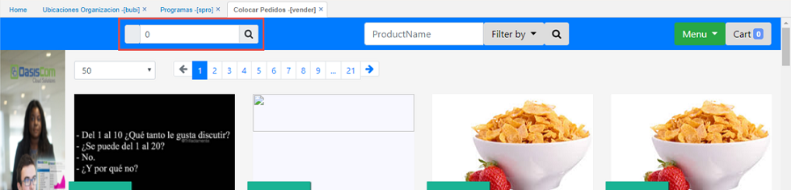

# Vender

La aplicación **Vender** muestra los productos del MarketPlace de acuerdo a las condiciones comerciales del tercero que se seleccione.  

Al seleccionar el tercero se muestran los productos de acuerdo al tipo de precio y demás condiciones que se le hayan asignado al cliente. Ingresamos el número de identificación o damos click en la lupa y lo seleccionamos del zoom.  

Seleccionado el tercero, la aplicación permite ordenar un pedido el cual se visualizará en la opción [**VPED - Pedidos**](http://docs.oasiscom.com/Operacion/scm/ventas/vpedido/vped):  

En la aplicación [**VPED - Pedidos**](http://docs.oasiscom.com/Operacion/scm/ventas/vpedido/vped) consultamos la orden de pedido por la fecha en que se realizó.  

