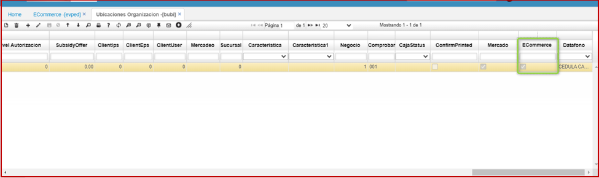
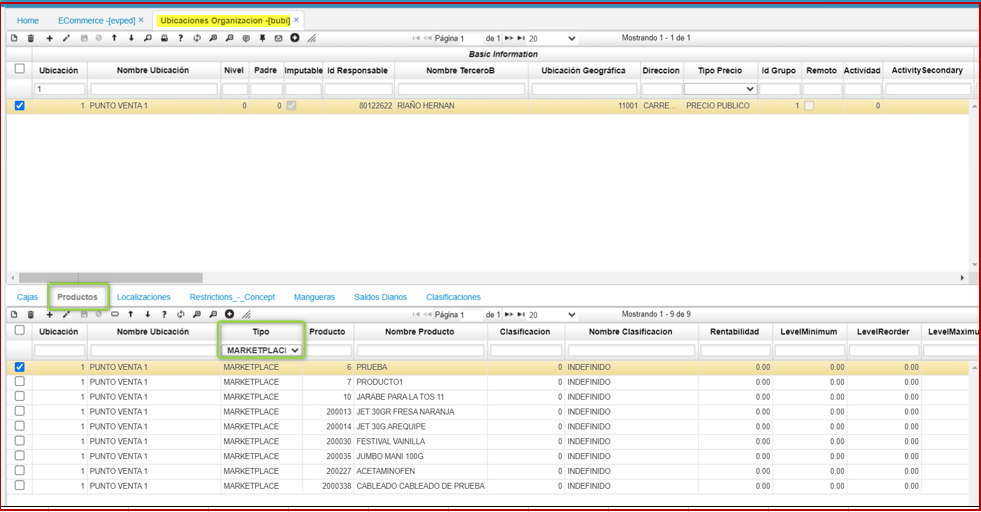

# EVPED - Colocar Pedidos

La aplicación EVPED permite realizar los pedidos por parte de los clientes propios de la empresa.  

Seleccionamos el producto dando click en el botón  y el producto será agregado al carrito de compras.  

Para confirmar el pedido damos click en el botón _Order_. Los pedidos realizados podrán ser vistos en la aplicación [**VPED - PEDIDOS**](http://docs.oasiscom.com/Operacion/scm/ventas/vpedido/vped).  

Al confirmar el pedido, le llegará un correo electrónico al usuario con la siguiente plantilla indicando los productos ordenados en el pedido.  

  

##Forma de parametrizar los productos.  
Al final del maestro el campo nuevo, Ecommerce, el cual si no está activo los productos no se visualizarán, es necesario mantener activo.  
 
  
En el detalle, existe una pestaña Productos, en donde configuraremos nuestros productos (estos productos deben estar parametrizados previamente en el BPRO), deben ser de Tipo Marketplace.  

  

