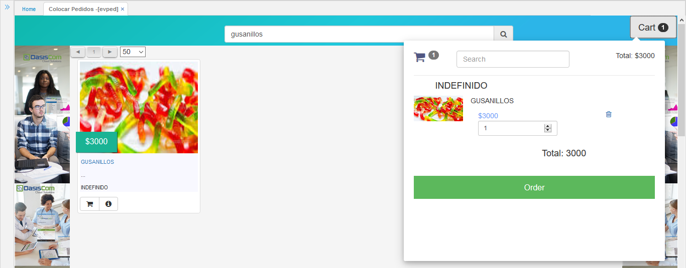

# EVPED - Colocar Pedidos

La aplicación EVPED permite realizar los pedidos por parte de los clientes propios de la empresa.

Seleccionamos el producto dando click en el botón  y el producto será agregado al carrito de compras.  

Para confirmar el pedido damos click en el botón _Order_. Los pedidos realizados podrán ser vistos en la aplicación [**VPED - PEDIDOS**](http://docs.oasiscom.com/Operacion/scm/ventas/vpedido/vped).  

