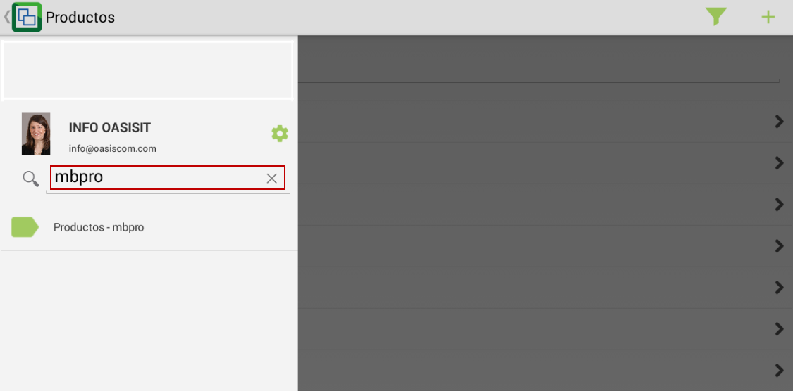
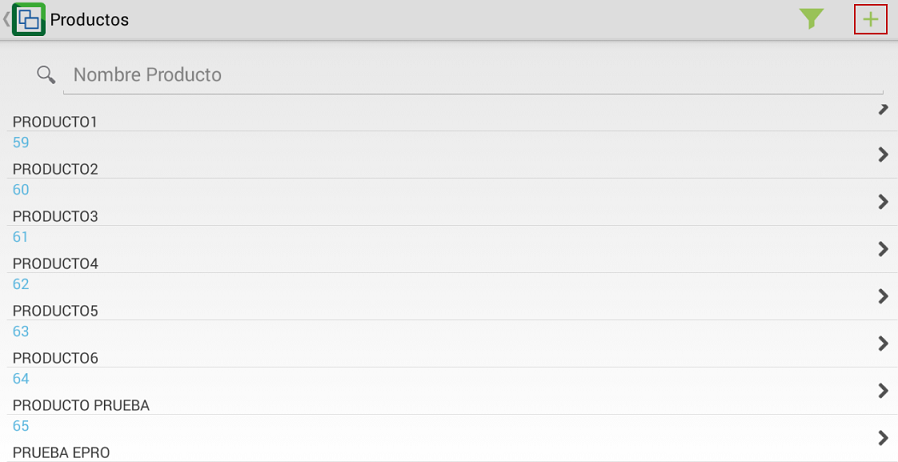
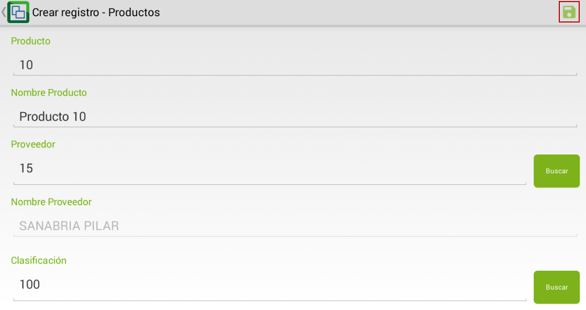
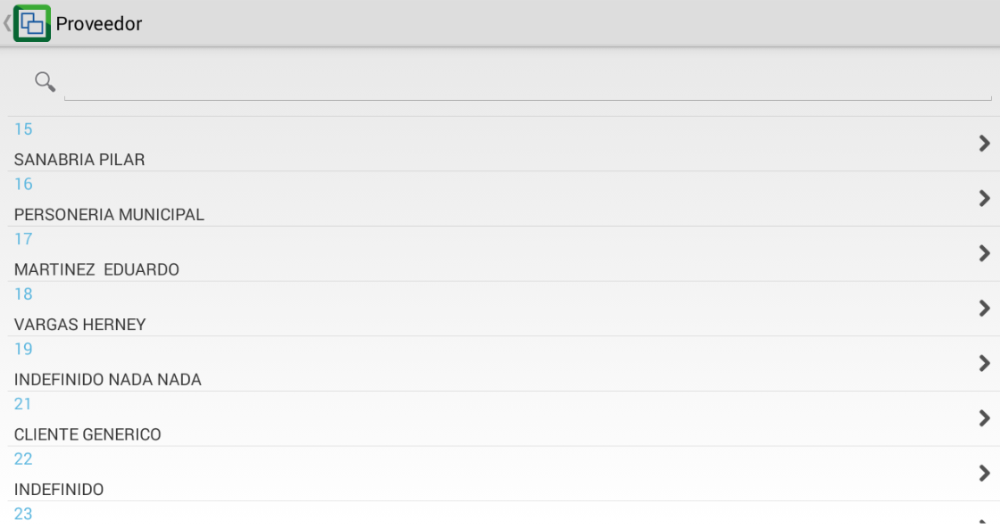
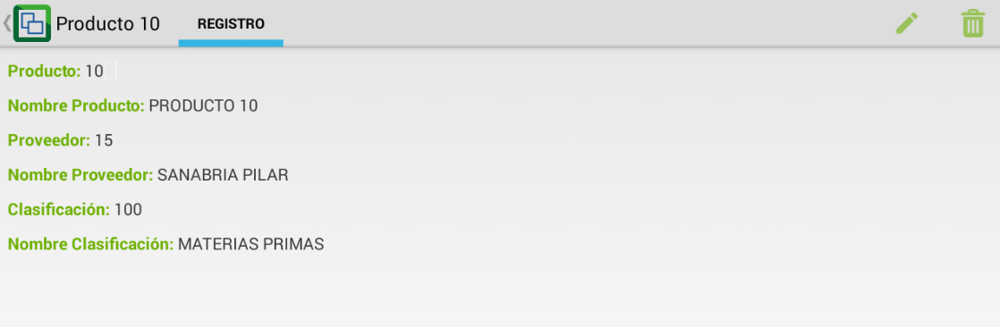

# MBPRO - Productos

La aplicación MBPRO muestra los productos y/o servicios que comercializa la compañía a la cual el usuario activo en el momento está asociado. Estos productos y servicios podrán ser modificados e incluso agregar más.  

Ingresamos a la aplicación y en el buscador digitamos las siglas **MBPRO**.  

Al ingresar a la aplicación encontraremos la lista de todos los productos registrados, para agregar uno nuevo, damos click en el botón .  

En la nueva ventana, diligenciaremos los datos del nuevo producto a registrar y guardaremos los cambios dando click en el botón .  

**Producto:** ingresar el número que será asignado al producto.  
**Nombre producto:** digitar el nombre del producto que se registra.  
**Proveedor:** ingresar el número de identificación del proveedor del producto. La aplicación permite buscar entre los terceros, el proveedor correspondiente.  

**Nombre proveedor:** al seleccionar el número de identificación del proveedor, el nombre será rellenado automáticamente.  
**Clasificación:** seleccionar la clasificación a la cual pertenece el producto que se registra.  

Al guardar se visualizarán los datos del nuevo producto registrado.  

En la parte superior derecha se visualizan los íconos de editar y eliminar respectivamente  en caso tal que se requiera actualizar la información del producto o se desee eliminar.  

