---
layout: default
title: Terceros
permalink: /Operacion/mpportal/mpproveedor/mbter
editable: si
---

# MBTER - Terceros

La aplicación móvil MBTER permite la creación y visualización de terceros que figuran como clientes del proveedor que se encuentra logueado en la aplicación.  

Ingresamos a la aplicación y en el buscador digitamos las siglas **MBTER**.  

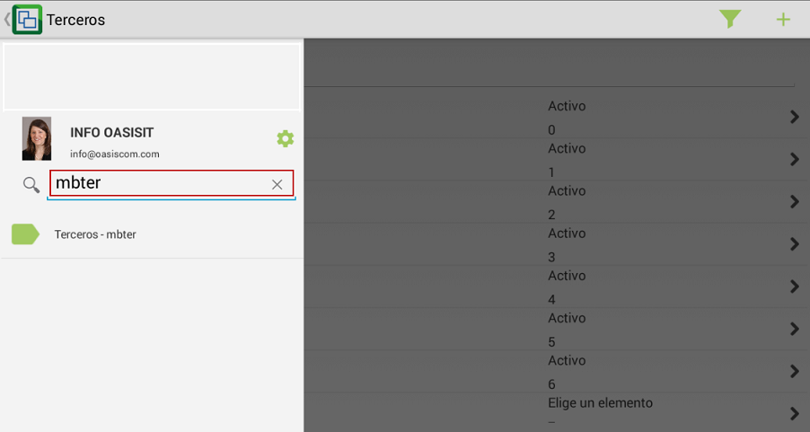

Al ingresar a la aplicación encontraremos la lista de todos los terceros registrados, para agregar uno nuevo, damos click en el botón .  

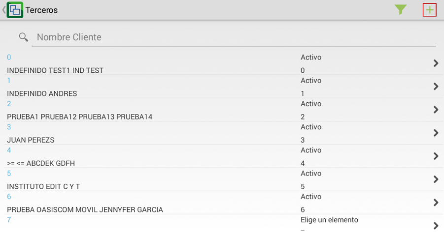

En la nueva ventana, diligenciaremos los datos del nuevo tercero a registrar y guardaremos los cambios dando click en el botón .  

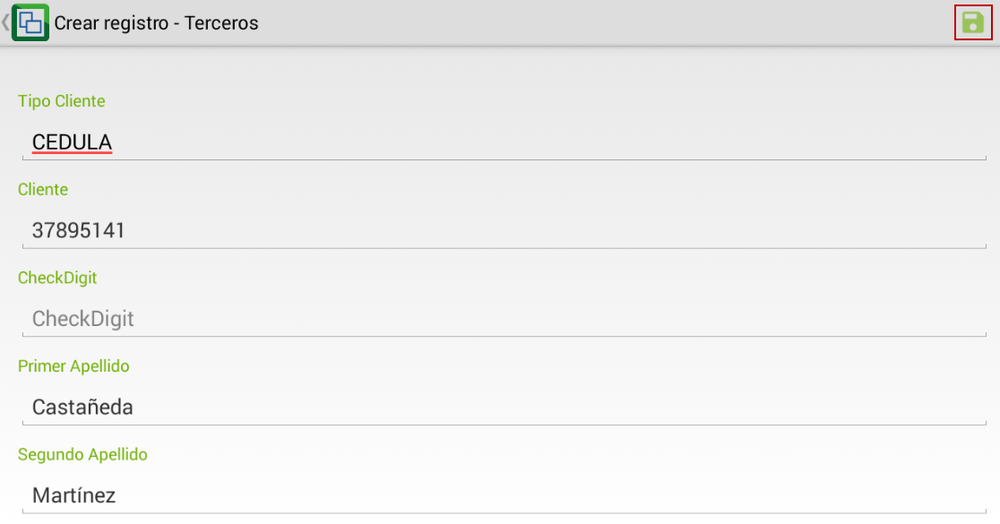

Al guardar se visualizarán los datos del nuevo tercero registrado.  

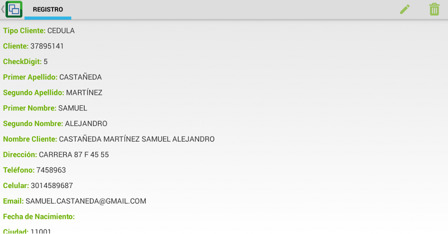

En la parte superior derecha se visualizan los íconos de editar y eliminar respectivamente  en caso tal que se requiera actualizar la información del tercero o se desee eliminar.  

# [Carga de imágenes a Terceros](http://docs.oasiscom.com/Operacion/mpportal/mpproveedor/mbter#carga-de-imágenes-a-terceros)

El sistema permite cargar imágenes a los terceros registrados, ya sea desde la galería o la cámara directamente. Esta funcionalidad está disponible para los sistemas Android y IOS.  

Para iniciar ingresaremos a la aplicación MBTER.  

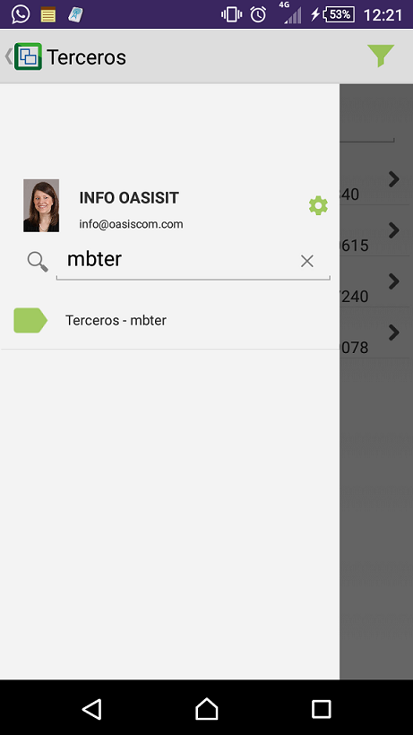

Seleccionamos el tercero al cual le cargaremos la imagen.  

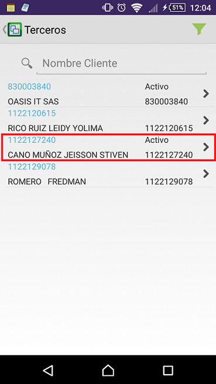

Seleccionado el tercero, damos click en el botón  para cargar la imagen.  

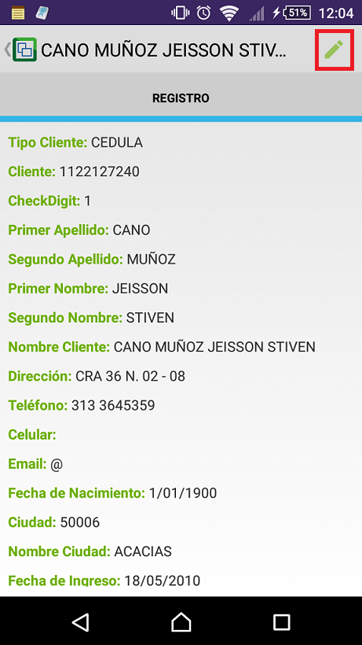

Al dar click en  la aplicación mostrará la imagen que tiene el tercero actualmente y su datos personales.  

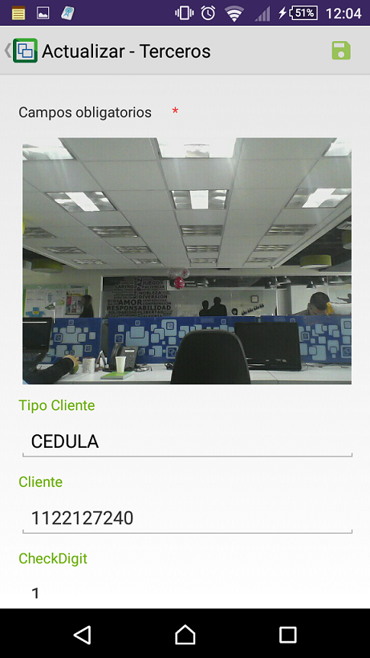

Para cambiar la imagen, tocamos sobre la misma e indicamos si cargaremos la imagen desde la galería o si se tomará la foto con la cámara.  

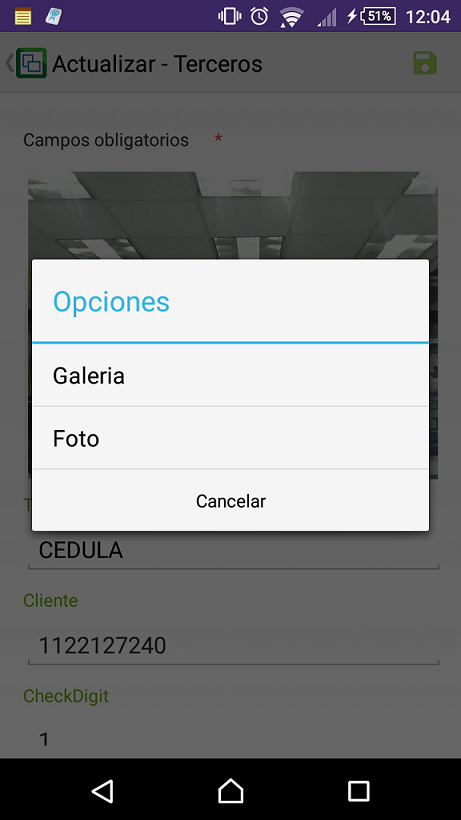

Si la imagen se encuentra almacenada en el dispositivo, seleccionamos _galeria_ y procedemos a buscarla.  



Seleccionada la imagen, damos click en el botón _Guardar_ .  

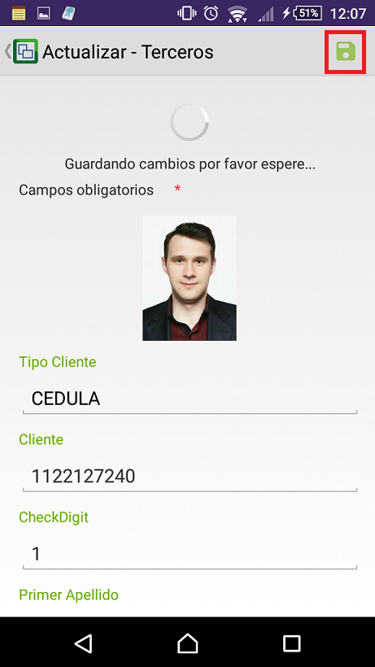

Si por el contrario la imagen no se encuentra guardada en el dispositivo, seleccionaremos la opción _FOTO_ y se activará la cámara.  

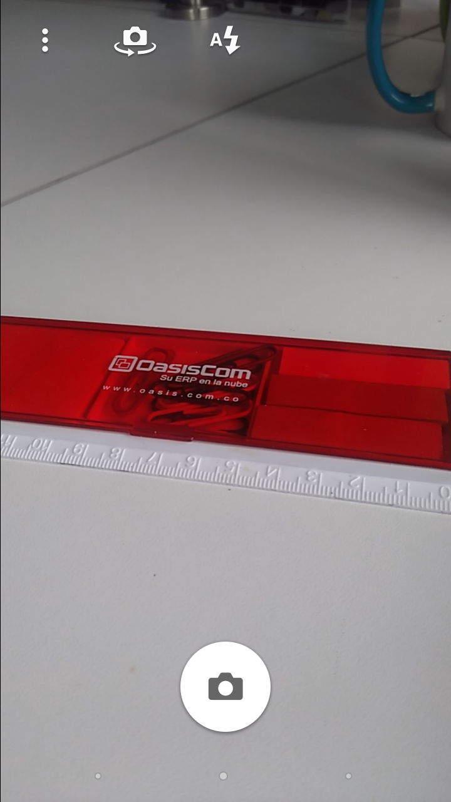

Finalmente, damos click en el botón _Guardar_ y la imagen quedará cargada al tercero seleccionado.  


