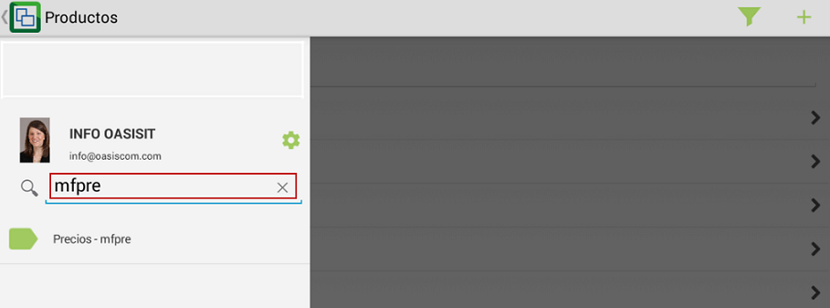
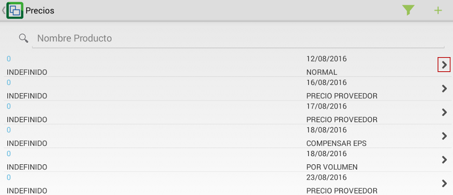
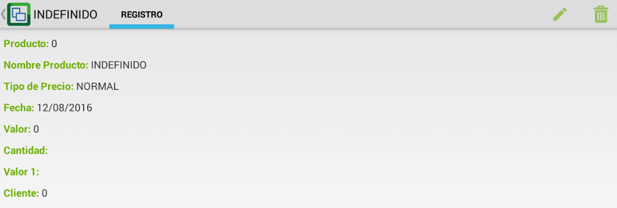
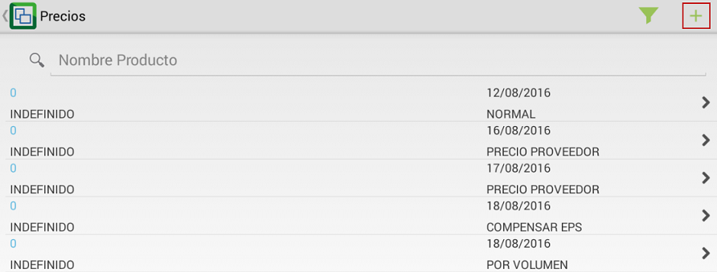
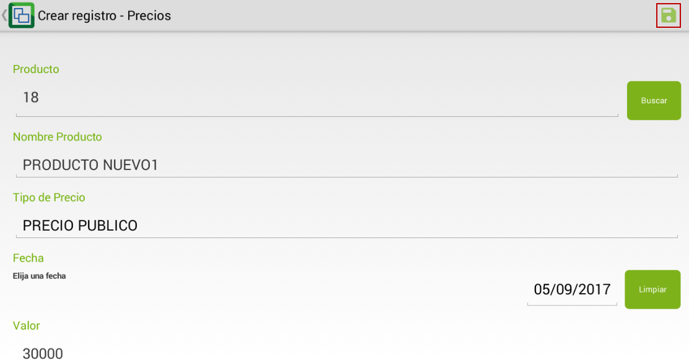
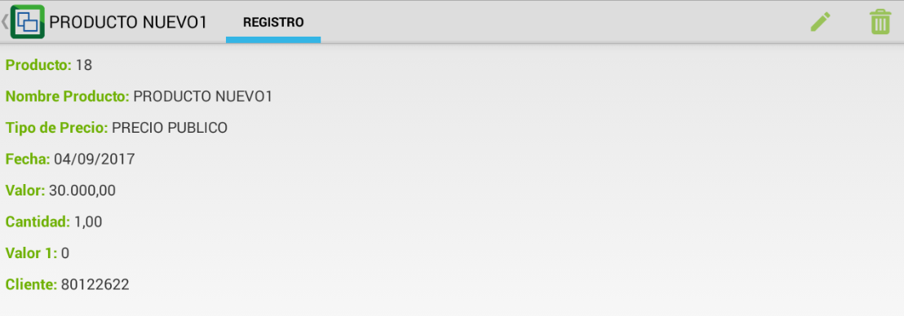

# MFPRE - Precios

La aplicación MFPRE muestra los precios de los productos y/o servicios de la compañía a la cual el usuario activo en el momento está asociado. A estos productos y servicios se les puede modificar el precio, cantidad, entre otras características.

Ingresamos a la aplicación y en el buscador digitamos las siglas **MFPRE**.  

Al ingresar a la aplicación encontraremos la lista de todos los precios registrados, para ver las caracteristicas de cada precio damos click en el botón  

Para agregar un nuevo precio, damos click en el botón .  

En la nueva ventana, diligenciaremos los datos del nuevo precio a registrar y guardaremos los cambios dando click en el botón .  

Aqui debemos seleccionar el producto al cual se le aplicará el precio y el tipo de precio.  

Al guardar se visualizarán los datos del nuevo precio registrado.  

En la parte superior derecha se visualizan los íconos de editar y eliminar respectivamente  en caso tal que se requiera actualizar la información del precio o se desee eliminar.  
