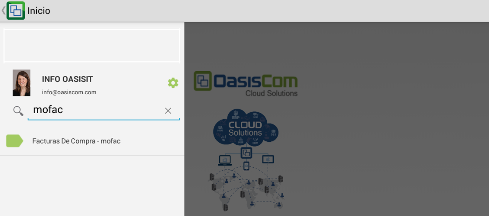
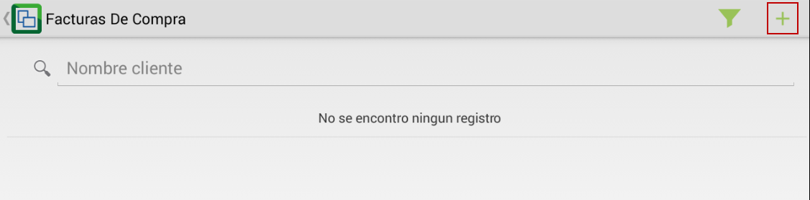
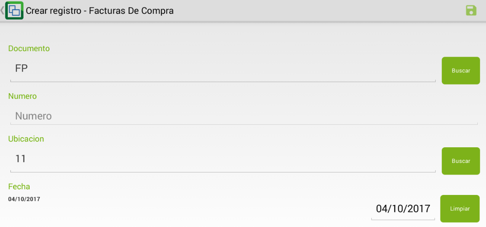
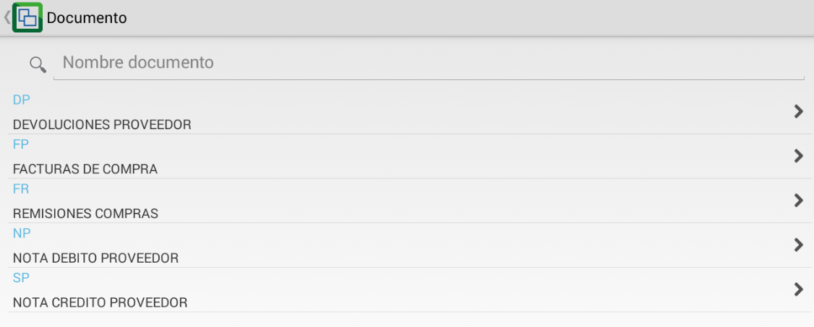
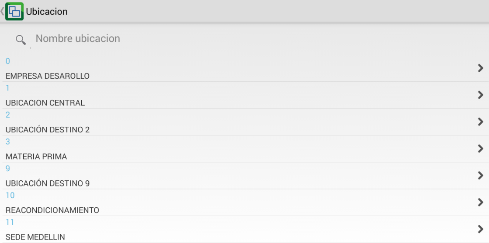
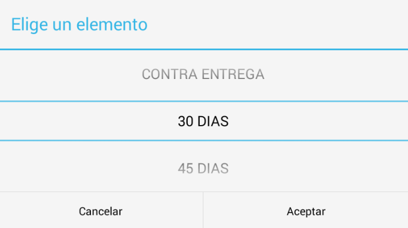
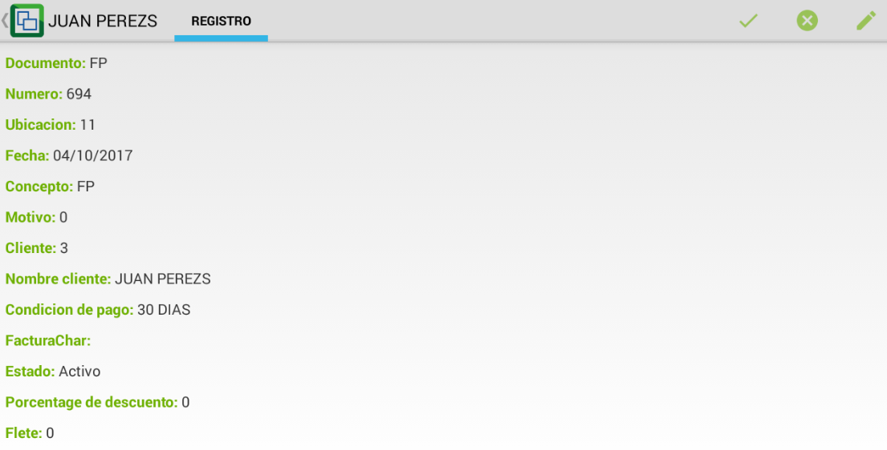

# MOFAC - Facturas de compra

La aplicación MOFAC permite registrar la factura de compra de uno o varios productos. Cuando se procese el registro el sistema realizará la contabilización pertinente.  

Ingresamos la aplicación en el buscador de OasisCom Móvil.

Para crear una nueva factura de compra, damos click en el botón  y el sistema arrojará un nuevo formulario de factura.  

Allí se deberán diligenciar todos los campos y seguidamente dar click en el botón _Guardar_ ubicado en la parte superior derecha de la pantalla .  

**Documento:** digitar FP (Facturas de compra) o dar click en el botón _Buscar_ y seleccionar el movimiento que se desea realizar.  Los documentos son parametrizables en la aplicación [**BDOC - Documentos**](http://docs.oasiscom.com/Operacion/common/bsistema/bdoc).  

**Ubicación:** digitar la ubicación desde donde se realiza la factura de compra o seleccionar la ubicación dando click en el botón _Buscar_. Las ubicaciones son parametrizables en la aplicación [**BUBI - Ubicaciones Organización**](http://docs.oasiscom.com/Operacion/common/borgan/bubi).  

**Fecha:** seleccionar la fecha en la cual se realiza la factura de compra.  
**Concepto:** seleccionar el concepto por el cual se realiza la factura de compra. Los conceptos son parametrizables en la aplicación [**BCON - Conceptos**](http://docs.oasiscom.com/Operacion/common/bsistema/bcon).  
**Motivo:** seleccionar el motivo relacionado a la factura de compra. Los motivos son parametrizables en la aplicación [**BMOT - Motivos**](http://docs.oasiscom.com/Operacion/common/bsistema/bmot).  
**Cliente:** ingresamos el número de identificación del proveedor a quien se le realizó la compra.  
**Condición de pago:** seleccionar la condición de pago definida en la compra.  

Guardados los cambios dando clickc en el botón  el sistema arrojará la información del la factura de compra realizada.  

En la esquina superior derecha se encuentran los botones  correspondiente a _Procesar_, _Anular_ o _Editar_.  

Si la factura se encuentra correcta, la procesaremos con el botón   

