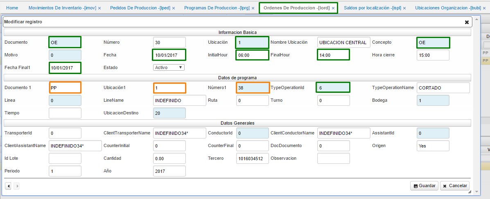
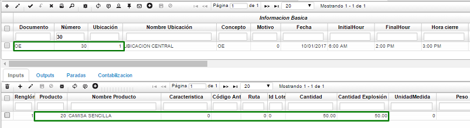
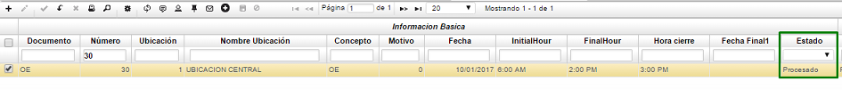
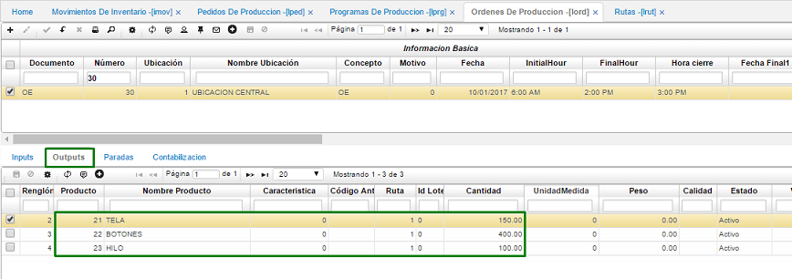
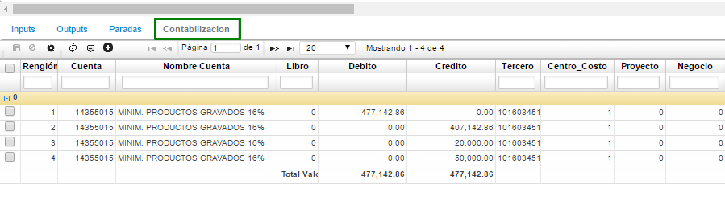

# ÓRDENES DE PRODUCCIÓN - LORD

Con esta aplicación se inicia el control de piso para transformar los insumos en el producto final, ingresando un registro de la siguiente manera:  

-	Documento: OE Orden de producción  
-	Ubicación: Ubicación de la planta en donde se realizará la producción, en este caso 1  
-	Concepto: OE Orden de producción  
-	Motivo: 0 indefinido  
-	Fecha: Fecha en la que iniciará la producción  
-	Hora inicial: Hora en la que iniciará la producción  
-	Hora Final: Hora en la que termina la producción  
-	Fecha final: Fecha en la que termina la producción  
-	Documento1: Programa de producción que se va a asociar, en este caso el 38  
-	Ubicación1: Ubicación del programa de producción anterior  
-	Número1: Número del programa de producción asociado  
-	Tipo de operación: La operación a realizar en este caso cortado, se debe poner el ID de la operación  

Al guardar el registro se visualiza que se diligencia automáticamente el detalle:

Posteriormente se procesa el registro

Una vez procesado las pestañas de outputs se diligencia de acuerdo a los insumos con sus respectivas cantidades que se utilizaron para dicho producto:

Y la respectiva contabilización

Aquí finaliza el proceso de producción.

