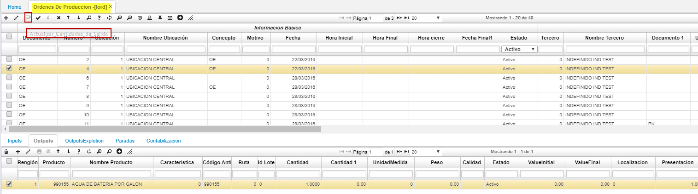
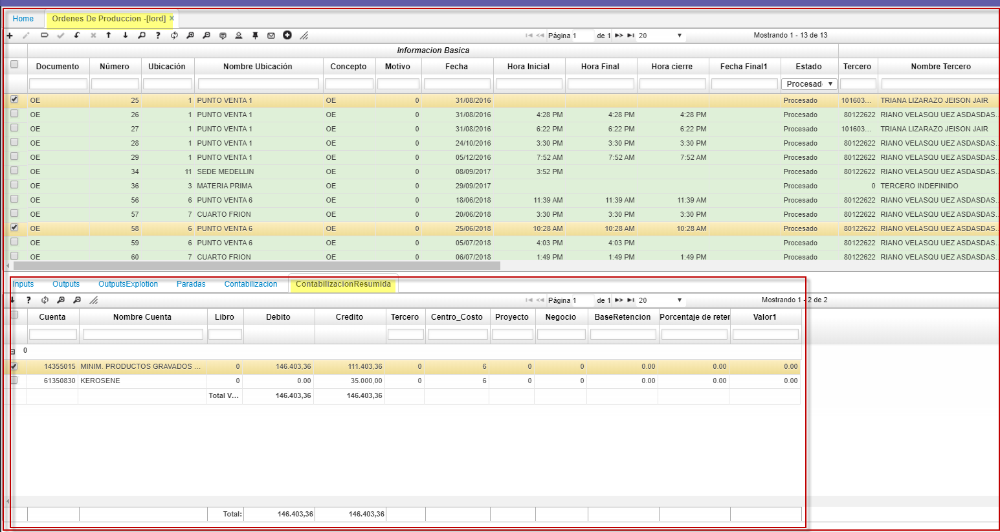
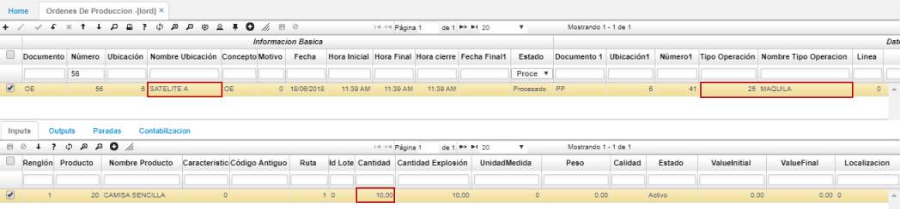
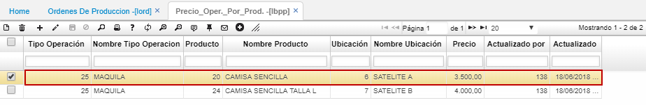
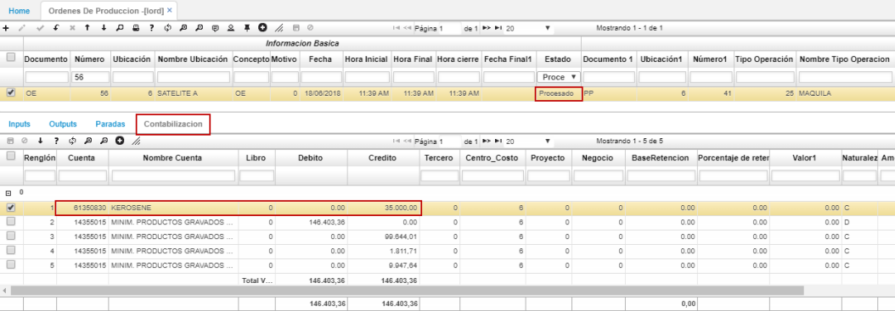

# LORD - Órdenes de producción

Cuando ya se tienen los insumos correspondientes en la planta se inicia el control de piso, lo cual son todas las operaciones respectivas para transformar al producto final. Por lo tanto, ingresamos a la aplicación **LORD – Ordenes de producción**, se crea un registro diligenciando los siguientes campos:  

**Documento:** OE Orden de producción.  
**Ubicación:** Ubicación de la planta en donde se realizará la producción, en este caso 1.  
**Concepto:** OE Orden de producción.  
**Motivo:** 0 indefinido.  
**Fecha:** Fecha en la que iniciará la producción.  
**Hora inicial:** Hora en la que iniciará la producción.  
**Hora Final:** Hora en la que termina la producción.  
**Fecha final:** Fecha en la que termina la producción.  
**Documento1:** Programa de producción que se va a asociar, en este caso el 38.  
**Ubicación1:** Ubicación del programa de producción anterior.  
**Número1:** Número del programa de producción asociado.  
**Tipo de operación:** La operación a realizar en este caso cortado, se debe poner el ID de la operación.  

* En la aplicacion **[LORD]** puede realizar la explosion del producto de salida por medio del siguiente botón, cuando aplique este proceso, segun su empresa.  

  

Al guardar el registro se visualiza que se diligencia automáticamente el detalle:  

En el campo _Calidad_ de la pestaña del detalle **Inputs**, se permite registrar por renglón varias fallas, causas y acciones e indicar el estado de la calidad. Estas se parametrizan en la aplicación [BCRC - Características](http://docs.oasiscom.com/Operacion/common/bcomer/bcrc).  

Parametrización en BCRC.  

Para asignar la calidad al producto del renglón, damos doble click en el zoom del campo _Calidad_, en la ventana agregamos un nuevo renglón por medio del botón **+**. Seleccionamos de la lista desplegable la calidad del producto.  

Seguidamente, si la calidad del producto tuvo algún defecto seleccionamos la falla, la causa y la acción que se tomó.  

Finalmente, registradas las diferentes fallas que pudieron ocurrir en la producción, damos click en _Aceptar_ y guardamos el registro en el detalle. El sistema asignará la letra que representa la calidad asignada.  

En la pestaña _PARADAS_ se registran los diferentes tipos de paradas existentes por orden. Los tipos de parada se parametrizan desde la opción [BCRC - Características](http://docs.oasiscom.com/Operacion/common/bcomer/bcrc).  

En **BCRC** para la característica de paradas de producción se asocian en el detalle los tipos de parada que se pueden presentar en la producción y los cuales asociaremos en la aplicación LORD.  

En la pestaña del detalle LORD agregamos un nuevc renglón y seleccionamos el tipo de parada presentado en la producción, la hora inicial y final y el producto al cual afectó. Guardamos el registro.  

Posteriormente se procesa el registro  

Una vez procesado las pestañas de outputs se diligencia de acuerdo a los insumos con sus respectivas cantidades que se utilizaron para dicho producto:  

Y la respectiva contabilización  

## [Pestaña Contabilización Resumida]  

Se crea la pestaña “contabilización resumida” donde se **totalizan** los valores de las cuentas parametrizadas.  
 

Aquí finaliza el proceso de producción.  

### [Tipo de operación Maquila](http://docs.oasiscom.com/Operacion/mrp/control/lcontrol/lord#tipo-de-operación-maquila)

En el momento de confirmar el registro de la orden de producción en la opción LORD y el tipo de operación es _**Maquila**_, el sistema contabilizará el CIF según el costo del satelite que ha sido parametrizado previamente en la aplicación [**LBPP - Precio operación por producto**](http://docs.oasiscom.com/Operacion/mrp/produccion/lbasica/lbpp) para esta operación, ya que el costo CIF cuando es maquila, debe ser el valor que cobra el maquilador.  

En el siguiente ejemplo, la orden de producción tiene ubicación del _SATELITE A_ y el tipo de operación es el 25 - Maquila, es decir, que el sistema tomará el valor de dicha operación por producto que se haya asignado de la aplicación LBPP.  

En la parametrización de la aplicación [**LBPP - Precio operación por producto**](http://docs.oasiscom.com/Operacion/mrp/produccion/lbasica/lbpp) para la operación de _maquila_ el satelite A cobra un valor de $3.500 por unidad del producto _Camisa Sencilla_.  

Como el pedido era de 10 camisas, el CIF calculado será de $35.000. La contabilización se verá reflejada en el momento que el documento se procese desde el maestro de la aplicación.  

