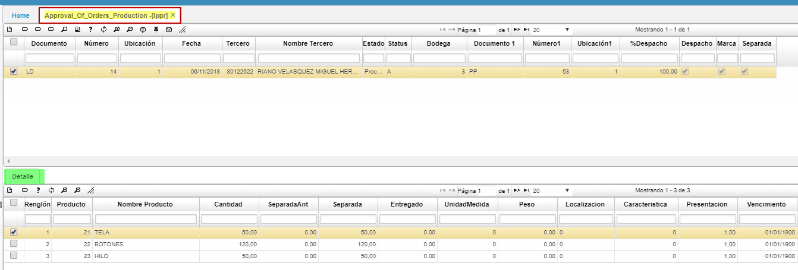
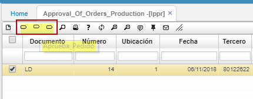

# LPPR - Approval Of Orders Production

Todos los pedidos de produccion**[LPED]**, para su despacho deben pasar el proceso de aprobación y que se ejecuta en esta opción **LPPR - Approval Of Orders Production**. El sistema muestra los pedidos **[LPED]** que han pasado por los controles de validación o liberación de cartera y los muestra en el orden en que han sido grabados o digitados, pero la problemática de las empresas requiere que los pedidos tengan diferentes prioridades y prelaciones para ello en las opciones básicas de ventas, se definen unas prioridades y márgenes de despacho de pedidos. El Campo Prioridad inicialmente tendrá valor cero “0” que al oprimir el Botón _Asig Prioridades_ el sistema calcula dichas prioridades según fueron establecidas, para después ordenarlas de mayor a menor o viceversa. Esta prioridad es sugerida ya que no es de obligatorio cumplimiento, el funcionario encargado será quien en ultimas toda la decisión de la aprobación de pedidos.  .

**Documento:** abreviaturas del tipo de documento a registrar.  
**Número:** consecutivo generado automáticamente.  
**Ubicación:** Número asignado a la empresa en la cual se aprueba el pedido.  
**Fecha:** fecha en la cual se aprueba el pedido.  
**Tercero:** número de identificación  del tercero al cual se le aprueba el pedido de produccion.  
**Nombre Tercero:** Nombre del tercero al cual se le aprueba el pedido de produccion.  
**Vendedor:** cédula del vendedor.  
**Total:** valor total del pedido **LPED**.  

**Estado:** estado del pedido: Activo, Procesado, Anulado.  

* La aplicación **LPPR** cuenta con una ventana inferior llamada **Detalle** la cual solo es de consulta, especifica los pedidos de los terceros anteriormente consultados en el maestro:  

* **Renglón:** número de renglón generado automáticamente.  
* **Producto:** número asignado al producto del pedido.  
* **Nombre producto:** nombre del producto del pedido.  
* **Cantidad:** cantidad en unidades del producto del pedido.  
* **Separada Anterior:**  cantidad de productos que son apardados anteriores.  
* **Separada:**  cantidad de productos que son apardados.  
* **Entregada:**  cantidad o valor de unidades del producto reales a fisicas, segun existencias.  
* **UnidadMedida:** basico del **BMED**.  
* **Peso:** unidad de medida fisica del producto.  
* **Localizacion** parametrizacion del basico de ubicaciones.  
* **%Caracteristica:** parametrizacion de **BCRC.**  
* **Presentacion:** corresponde del producto en **BPRO.**  
* **%Vencimiento:** fecha que se relaciona en el basico de productos.  

**En el maestro de la opcion existen tres botones, donde radica la funcionabilidad de la aplicacion: Approval Of Orders Production** **[LPPR]**
* **Marcar:** indica a cuales de los pedidos de produccion le vamos a aplicar las modificaciones.  
* **Aprueba:** Pedido: al aplicar el boton el estatus del pedido cambia segun el STATUS.  
* **Devuelve Pedido:** aplica para cambiarle  de status  al pedido de produccion, devolviendo a status anterior.  

