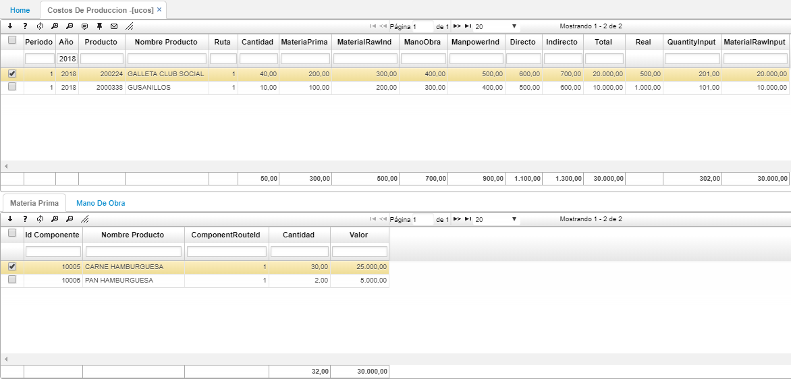
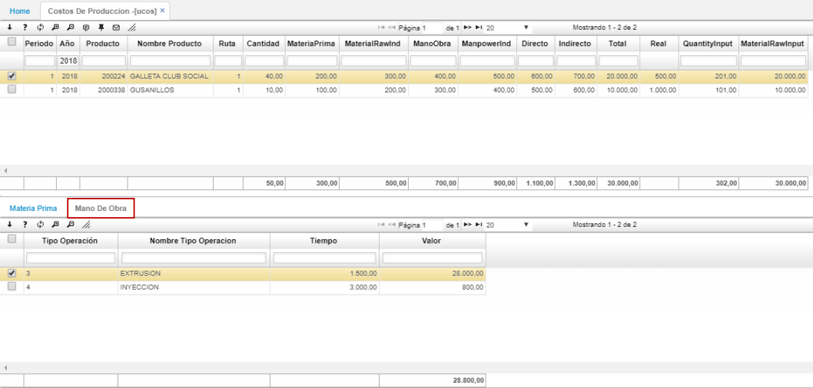

# UCOS - Costos de Producción

La aplicación **UCOS** permite la visualización de datos de un proceso de producción. Allí se verán reflejados los costos de la materia prima, mano de obra, costos directos e indirectos y el total de la producción. Igualmente, en el detalle se verán los componentes del producto final, las cantidades utilizadas y el valor. En la segunda pestaña del detalle, se reflejarán las operaciones realizadas por la mano de obra, el tiempo y el valor de cada operación.

Detalle  

