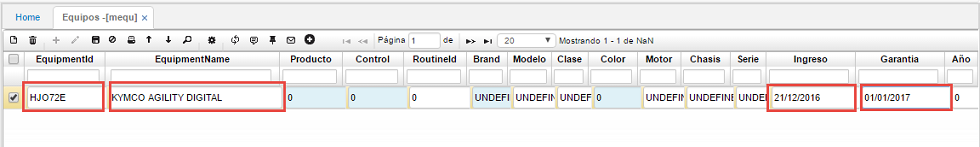
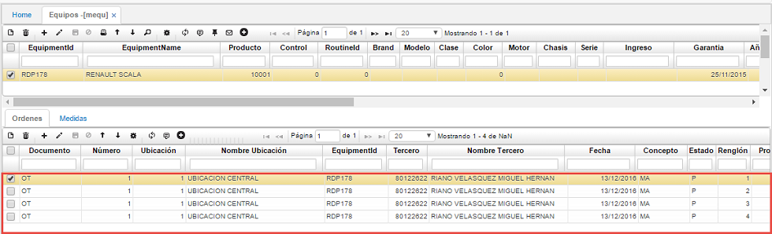

## Equipos

La aplicación **MEQU** es utilizada para realizar la administración de los equipos a los cuales se les hace mantenimiento, estos equipos pueden ser propios de la empresa (activos fijos) o de clientes externos.  

En el maestro, agregamos un nuevo registro y diligenciamos los siguientes campos.  

**Id Equipo:** ingresar el código del equipo. Este código puede contener tanto letras, números y caracteres y debe ser exclusivo para cada equipo creado.  
**Nombre del Equipo:** ingresar el nombre del equipo el cual se registra.  
**Ingreso:** hace referencia a la fecha en la que se ingresó el equipo al sistema.  
**Garantía:** indica el comienzo de la garantía del equipo ingresado.  

En cuanto al detalle, este se refiere a un historial de las ordenes de servicio generadas de manera automática cuando se crea una orden para dicho equipo.  

