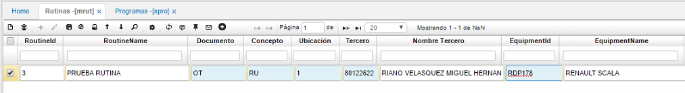

## Rutinas

La aplicación **MRUT – Rutinas**, permite realizar las revisiones de rutina de los equipos y determinar su periodicidad.  

En el maestro, agregamos un nuevo registro y diligenciamos los siguientes campos.  

**Id Rutina:** se debe ingresar el número de la rutina, este número no es un consecutivo, pero este debe ser exclusivo para cada rutina creada.  
**Nombre Rutina:** ingresar el nombre de la rutina, este campo admite tanto letras como números y caracteres.  
**Documento:** dar doble click y seleccionar del zoom el documento OT – Orden de trabajo. Estos documentos son parametrizables en la opción [**BDOC – Documentos**](https://github.com/OasisCom/Docs/blob/master/Operacion/common/bsistema/bdoc.md).  

**Concepto:** dar doble click y seleccionar del zoom el concepto RU – Rutinas. Los conceptos son parametrizables en la opción [**BCON – Conceptos**](https://github.com/OasisCom/Docs/blob/master/Operacion/common/bsistema/bcon.md).  

**Ubicación:** seleccionar del zoom la ubicación correspondiente a la rutina.  

**Tercero:** ingresar el número de identificación del tercero propietario del equipo al que se le realizará la revisión de rutina.  
**Nombre Tercero:** se diligenciará de manera automática una vez se haya ingresado el número de identificación del tercero.  
**Id Equipo:** dar doble click en el zoom y seleccionar el código del equipo al cual se le realizará la revisión de rutina. Cabe recordar que los equipos son parametrizados en la opción MEQU – Equipos.  

**Nombre Equipo:** se diligenciará de manera automática una vez sea ingresado el código del equipo.  
**Tipo Frecuencia:** se debe seleccionar el tipo de periodicidad que se requiere para realizar las revisiones, puede seleccionarse una de las siguientes opciones:  

**Frecuencia:** se debe ingresar la frecuencia con la que se realizarán las revisiones de rutina de acuerdo al tipo de frecuencia seleccionado.  
**Estado:** se puede seleccionar una de las siguientes opciones:  

 * _Activo:_ Permite la edición y modificación del registro.  
 * _Inactivo:_ El registro no permite la edición del registro ni ser referenciado desde otras aplicaciones.  
 * _Retirado:_ Este estado indica que el doctor ya no realiza ningún tipo de función.  

**Id Recurso:** se debe ingresar el número de identificación del operario que llevará a cabo estas revisiones de rutina. Se debe tener en cuenta que el recurso puede referirse a una persona o a un grupo de personas (infraestructura o área).  Los recursos son parametrizados en la opción [**AREC - Recursos**]().

