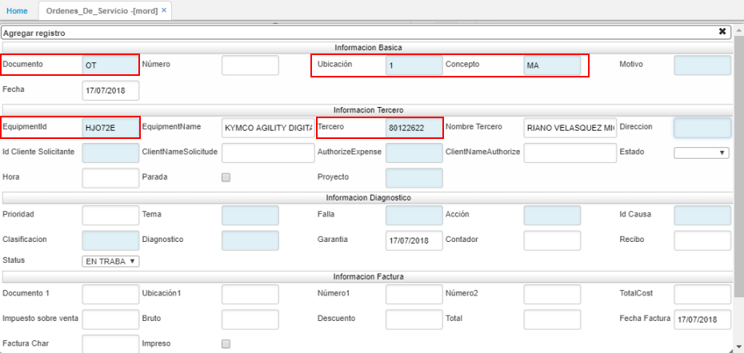
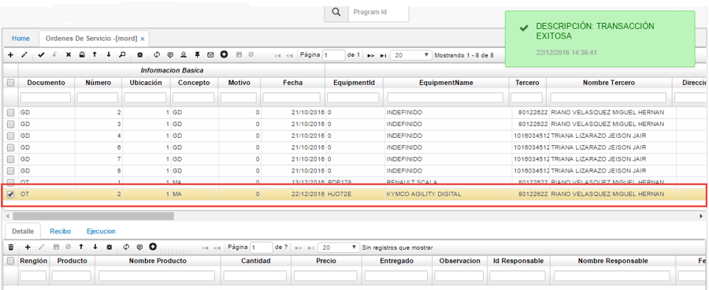
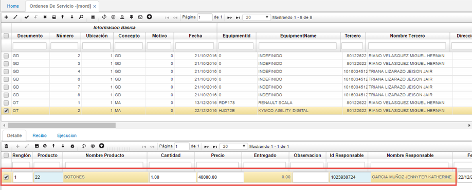
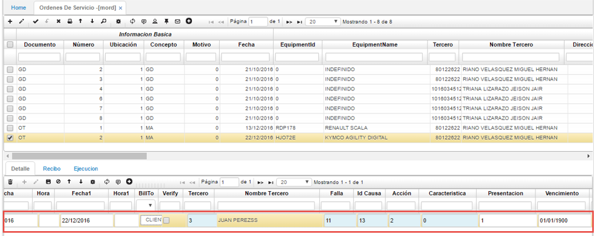

# MORD - Ordenes de Trabajo

Esta opción es usada para realizar la creación de ordenes de servicio para aquellos equipos que requieren de algún tipo de mantenimiento. En la opción MORD se realiza la creación de estas órdenes así:  

**Documento:** se debe seleccionar el tipo de documento de la orden de servicio a crear. En este caso, se creará una orden de servicio con el documento OT que corresponde a una orden de trabajo.  
**Ubicación:** se debe diligenciar la ubicación en donde se realizará el mantenimiento correspondiente al equipo.  
**Concepto:**debe seleccionarse una de las siguientes opciones según el mantenimiento a realizarse:  

* **MA:** Mantenimiento
* **MC:** Mantenimiento Correctivo
* **MD:** Adecuaciones de Equipo
* **MP:** Mantenimiento Preventivo
* **MR:** Mantenimiento Predictivos
* **RU:** Rutina

En este caso se selecciona el concepto **MA**.  

**Fecha:** se debe ingresar la fecha de realización del mantenimiento.  
**EquipmentId:** se debe ingresar el Id del equipo al cual se le realizará el mantenimiento. Hay que recordar que los equipos son parametrizados en la opción **MEQU - Equipos**.  
**EquipmentName:** se llenará de manera automática una vez se haya diligenciado el Id del equipo.  
**Tercero:** hace referencia al número de identificación del cliente propietario del equipo al que se realizará mantenimiento.  
**Nombre Tercero:** se diligencia de manera automática una vez ingresado el número de identificación del tercero.  

Hecho esto, se procede a guardar el registro.  

Luego de diligenciar los campos del maestro como corresponde, se procede a diligenciar los campos del detalle, así:  

**Renglón:** se diligencia de manera automática cuando se guarda el registro.  
**Producto:** hace referencia a productos terminados (suministros, materia prima) que se pueden necesitar para realizar el mantenimiento correspondiente. Por ejemplo, para el equipo Kymco se requiere realizar un cambio de llantas, este corresponde a un producto físico del equipo, además de realizar también un cambio de aceite, correspondiendo este a un servicio. En este campo se diligencia el Id del producto ya sea desde el zoom o de manera manual.  
**Nombre Producto:** se llena de manera automática una vez diligenciado el Id del producto.  
**Cantidad:** se debe diligenciar la cantidad del producto a adquirir.  
**Precio:** se diligencia el valor del producto.  
**Observación:** se podrá realizar una breve descripción si así se requiere.  
**Id Responsable:** se debe ingresar el número de identificación del operario responsable de dicho producto para la realización del mantenimiento.  
**Nombre Responsable:** se llena de manera automática una vez ingresado el Id del responsable.  

  

**Fecha:** se debe ingresar la fecha de realización del mantenimiento del producto o servicio en cuestión.  
**BillTo:** hace referencia a quien se realizará la facturación del producto, puede seleccionarse una de las siguientes opciones:  

 * **CLIENTE:** Se realizará la facturación al cliente propietario del equipo.
 * **EMPRESA:** Corresponde a la garantía del equipo que será cubierto por la empresa.
 * **SEGURO:** Se realizará la facturación a un seguro en caso de algún desperfecto o servicio que requiera del mismo.

**Tercero:** se debe ingresar el número de identificación de la persona a quien se le realizará la facturación del producto en mantenimiento.  
**Nombre Tercero:** se llena automáticamente una vez se ha ingresado el número de identificación del tercero.  
**Falla:** se debe diligenciar el desperfecto por el cual se está realizando el mantenimiento. _El dato de este campo se puede seleccionar desde el zoom o ingresarlo manualmente_.  
**Id Causa:** se debe diligenciar la causa de la falla. _El dato de este campo se puede seleccionar desde el zoom o ingresarlo manualmente_.
**Acción:** se debe diligenciar la acción tomada para corregir la falla. _El dato de este campo se puede seleccionar desde el zoom o ingresarlo manualmente_.

Posteriormente se guarda el registro.  
