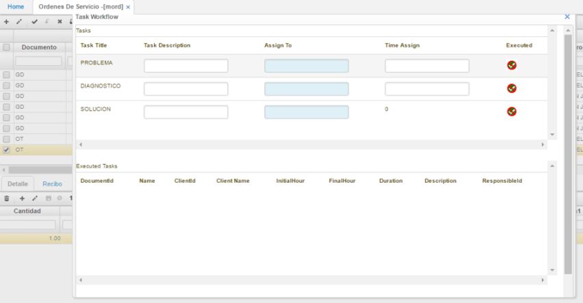
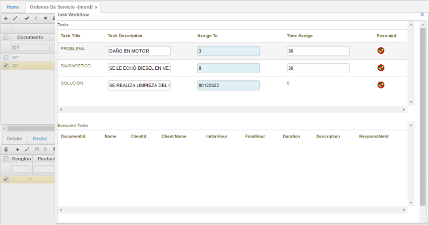
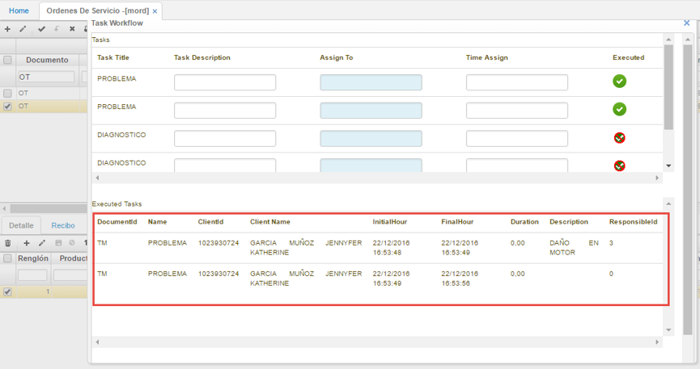
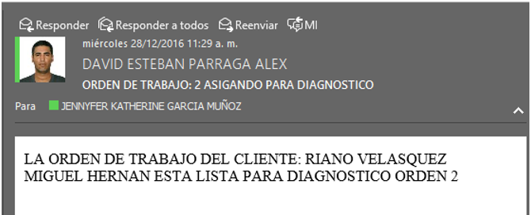
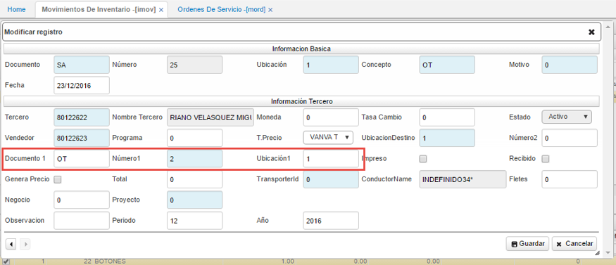
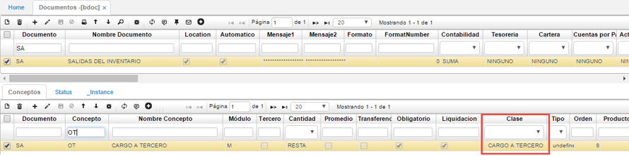
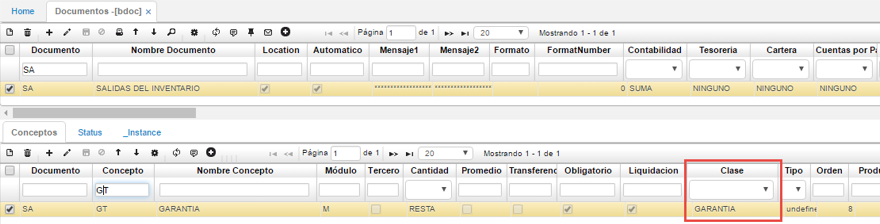
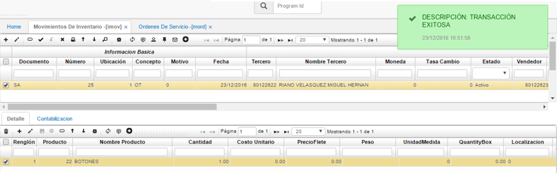
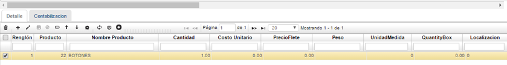
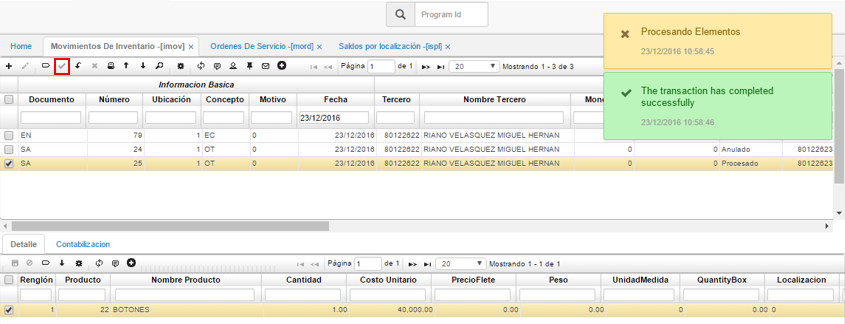

# Ordenes de Trabajo

### **Menú**

1. [**MORD - Ordenes de Trabajo**](http://docs.oasiscom.com/Operacion/mrp/mantenimiento/morden/mord#mord---ordenes-de-trabajo)  
2. [**WorkFlow Task**](http://docs.oasiscom.com/Operacion/mrp/mantenimiento/morden/mord#workflow-task)

## [MORD - Ordenes de Trabajo](http://docs.oasiscom.com/Operacion/mrp/mantenimiento/morden/mord#mord---ordenes-de-trabajo)

Esta opción es usada para realizar la creación de ordenes de servicio para aquellos equipos que requieren de algún tipo de mantenimiento. En la opción MORD se realiza la creación de estas órdenes así:  

**Documento:** se debe seleccionar el tipo de documento de la orden de servicio a crear. En este caso, se creará una orden de servicio con el documento OT que corresponde a una orden de trabajo.  
**Ubicación:** se debe diligenciar la ubicación en donde se realizará el mantenimiento correspondiente al equipo.  
**Concepto:**debe seleccionarse una de las siguientes opciones según el mantenimiento a realizarse:  

* **MA:** Mantenimiento
* **MC:** Mantenimiento Correctivo
* **MD:** Adecuaciones de Equipo
* **MP:** Mantenimiento Preventivo
* **MR:** Mantenimiento Predictivos
* **RU:** Rutina

En este caso se selecciona el concepto **MA**.  

**Fecha:** se debe ingresar la fecha de realización del mantenimiento.  
**EquipmentId:** se debe ingresar el Id del equipo al cual se le realizará el mantenimiento. Hay que recordar que los equipos son parametrizados en la opción **MEQU - Equipos**.  
**EquipmentName:** se llenará de manera automática una vez se haya diligenciado el Id del equipo.  
**Tercero:** hace referencia al número de identificación del cliente propietario del equipo al que se realizará mantenimiento.  
**Nombre Tercero:** se diligencia de manera automática una vez ingresado el número de identificación del tercero.  

Hecho esto, se procede a guardar el registro.  

Luego de diligenciar los campos del maestro como corresponde, se procede a diligenciar los campos del detalle, así:  

**Renglón:** se diligencia de manera automática cuando se guarda el registro.  
**Producto:** hace referencia a productos terminados (suministros, materia prima) que se pueden necesitar para realizar el mantenimiento correspondiente. Por ejemplo, para el equipo Kymco se requiere realizar un cambio de llantas, este corresponde a un producto físico del equipo, además de realizar también un cambio de aceite, correspondiendo este a un servicio. En este campo se diligencia el Id del producto ya sea desde el zoom o de manera manual.  
**Nombre Producto:** se llena de manera automática una vez diligenciado el Id del producto.  
**Cantidad:** se debe diligenciar la cantidad del producto a adquirir.  
**Precio:** se diligencia el valor del producto.  
**Observación:** se podrá realizar una breve descripción si así se requiere.  
**Id Responsable:** se debe ingresar el número de identificación del operario responsable de dicho producto para la realización del mantenimiento.  
**Nombre Responsable:** se llena de manera automática una vez ingresado el Id del responsable.  

  

**Fecha:** se debe ingresar la fecha de realización del mantenimiento del producto o servicio en cuestión.  
**BillTo:** hace referencia a quien se realizará la facturación del producto, puede seleccionarse una de las siguientes opciones:  

 * **CLIENTE:** Se realizará la facturación al cliente propietario del equipo.
 * **EMPRESA:** Corresponde a la garantía del equipo que será cubierto por la empresa.
 * **SEGURO:** Se realizará la facturación a un seguro en caso de algún desperfecto o servicio que requiera del mismo.

**Tercero:** se debe ingresar el número de identificación de la persona a quien se le realizará la facturación del producto en mantenimiento.  
**Nombre Tercero:** se llena automáticamente una vez se ha ingresado el número de identificación del tercero.  
**Falla:** se debe diligenciar el desperfecto por el cual se está realizando el mantenimiento. _El dato de este campo se puede seleccionar desde el zoom o ingresarlo manualmente_.  
**Id Causa:** se debe diligenciar la causa de la falla. _El dato de este campo se puede seleccionar desde el zoom o ingresarlo manualmente_.  
**Acción:** se debe diligenciar la acción tomada para corregir la falla. _El dato de este campo se puede seleccionar desde el zoom o ingresarlo manualmente_.  

Posteriormente se guarda el registro.  

## [WorkFlow Task](http://docs.oasiscom.com/Operacion/mrp/mantenimiento/morden/mord#workflow-task)

En esta opción es posible realizar la asignación y ejecución de actividades correspondientes al mantenimiento de un equipo. Esta funcionalidad se encuentra dentro de la opción MORD, más exactamente en el icono de la botonera que corresponde a .  

Una vez seleccionado se enseña la siguiente ventana emergente:  

 * En el renglón _Problema_ ingresaremos la información así:  

**Task Description:** se debe ingresar la descripción del problema. Esta descripción es diligenciada por el usuario correspondiente a detectar el problema del equipo.  
**Assign To:** se debe ingresar el responsable (operario) al que se le asignará la próxima tarea, es decir, el diagnóstico de dicho problema.  
**Time Assign:** se debe ingresar el tiempo de ejecución que tendrá el operario asignado para ejecutar la siguiente tarea.  

 * En el renglón _Diagnóstico_ ingresaremos la información así:  

**Task Description:** se debe ingresar la descripción del diagnóstico o las causas del daño del equipo en cuestión.  
**Assign To:** se debe ingresar el responsable (operario) al que se le asignará la próxima tarea, es decir, la solución al diagnóstico.  
**Time Assign:** se debe ingresar el tiempo de ejecución que tendrá el operario asignado para ejecutar la siguiente tarea.  

 * En el renglón _Solución_ ingresaremos la información así:  

**Task Description:** se debe ingresar la descripción de la solución al problema en cuestión.  
**Assign To:** no se debe diligenciar, ya que se ha llegado a la solución del problema. Este campo puede ser diligenciado si efectivamente no se encontró una solución y por consiguiente se repite el mismo proceso a partir del campo _Problema_.  
**Time Assign:** no requiere de tiempo de ejecución dado que esta última tarea corresponde a la solución del problema en cuestión.  

En la columna _Executed_ el icono   cumple la función de ejecutar las tareas y generar un registro de las mismas el cual puede ser visualizado así:  

Hecho esto, debe llegar un correo electrónico al operario responsable de realizar la tarea, para que esta sea debidamente ejecutada:  

Una vez creada la orden de servicio y los productos correspondientes, se debe realizar la salida de inventario de los productos necesarios para realizar el mantenimiento al equipo. Esto se realiza a través de la opción [**IMOV – Movimientos de Inventario**]() (_Ver aplicación_).  

[**Salida de inventario en IMOV**]()

Creamos un nuevo registro en la aplicación IMOV y diligenciamos el formulario:  

**Documento:** para esta opción se trabajará con el documento _SA_ que corresponde a una Salida de Inventario.  
**Ubicación:** se debe seleccionar ya sea desde el zoom o ingresarlo manualmente, la ubicación en donde se está separando el producto necesario para efectuar la orden de servicio.  
**Concepto:** se debe seleccionar el concepto por el cual se facturará la orden, en este caso es _OT – Cargo a Tercero_ dado que la factura será cargada al cliente propietario del equipo al cual se le realiza el mantenimiento.  

 _**NOTA:**_ Se debe considerar que, de acuerdo al concepto elegido, deben estar parametrizados de la siguiente manera en la opción [**BDOC - Documentos**](http://docs.oasiscom.com/Operacion/common/bsistema/bdoc):

 * Si se eligió **OT** en el campo concepto, en el campo _Clase_ del detalle de esta opción, debe estar seleccionada la opción _Cargo a tercero_:  

 * Si se eligió el concepto **GT**, en el campo _Clase_ del detalle de esta opción, debe estar seleccionada la opción _Garantía_:  

 _**Fin de la nota.**_

**Tercero:** se debe ingresar el número de identificación del tercero al cual se le va a cargar la factura correspondiente.  
**Nombre Tercero:** se llena de manera automática una vez ingresado el número de identificación del tercero.  
**Documento 1, Número 1** y **Ubicación 1:** se deben diligenciar de acuerdo con lo llenado en el registro de la opción **MORD**, de esta manera deberá ponerse _OT_, _2_ y _1_ respectivamente.  

Posteriormente se guarda el registro.  

Nótese como el registro del detalle se llena de manera automática mostrando el producto que fue ingresado en la opción **MORD** para realizar la salida de inventario correspondiente.  

Posteriormente, se procesa el documento de salida de inventario en IMOV.  

