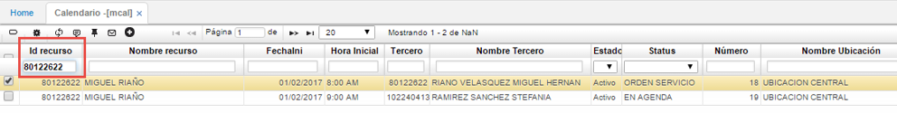
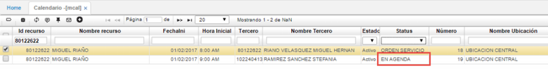
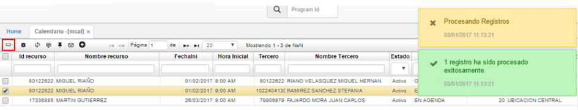
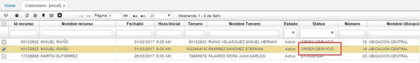
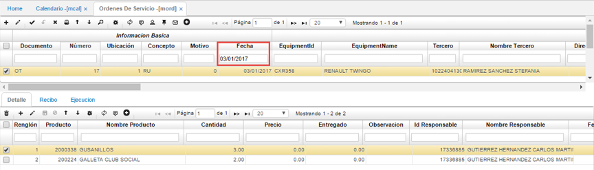
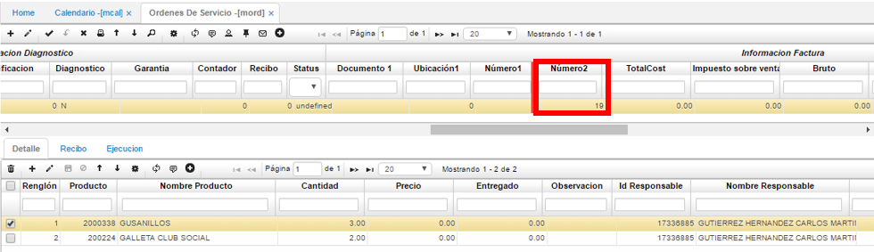
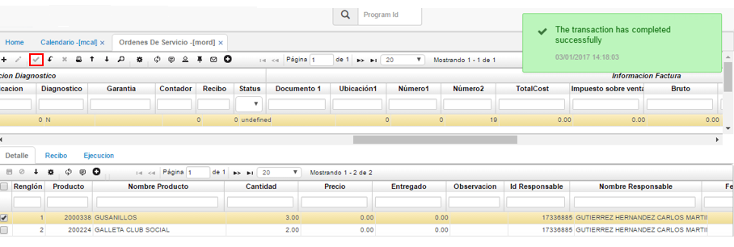
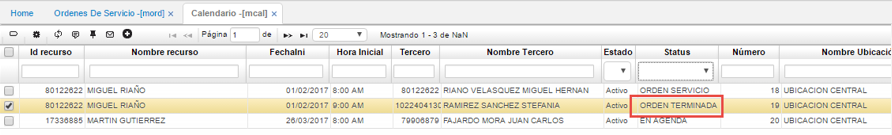

# MCAL - Calendario

La opción MCAL permite visualizar la planeación realizada desde la opción [**MPGA - Generar Calendario**](http://docs.oasiscom.com/Operacion/mrp/mantenimiento/mpreventivo/mpga).  

En el campo **Id Recurso** se debe ingresar el número de identificación de la persona a la cual se le realizó la planeación desde la opción [**MPGA**](http://docs.oasiscom.com/Operacion/mrp/mantenimiento/mpreventivo/mpga).  

Adicional a esto, puede notarse como los registros generados se muestran con el estado _En Agenda_, el cual hace referencia a que el recurso se encuentra agendado para ejecutar una revisión de rutina en la fecha y hora que enseña el registro en cuestión.  

Esta opción es estrictamente de consulta, es decir, no permite crear, editar o eliminar los registros que aquí se visualizan.  

Luego de esto, si se desea generar una orden de servicio sobre este registro planeado, se debe seleccionar el botón   (_Genera_Orden_):  

El registro pasa de estar en estado _En Agenda_ a _Orden Servicio_:  

Este último estado indica que se ha creado una nueva orden de servicio a partir de este registro planeado, con lo que se puede consultar en la opción [**MORD - Ordenes de servicio**](http://docs.oasiscom.com/Operacion/mrp/mantenimiento/morden/mord#mord---ordenes-de-trabajo), ingresando la fecha de la creación de la orden desde el _MCAL_.  

_En MORD - Ordenes de servicio_  

En esta orden de servicio se puede visualizar el número de la rutina asociada a esta, esto se puede ver en el campo _Número2_:  

Al procesar la orden de servicio, el registro en la opción _MCAL_ debe pasar de estado _Orden Servicio_ a _Orden Terminada_.  

Cambio de estado en la opción _MCAL - Calendario_.  

