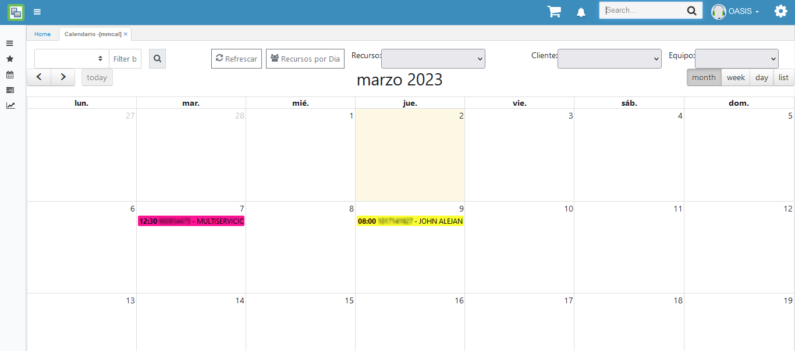
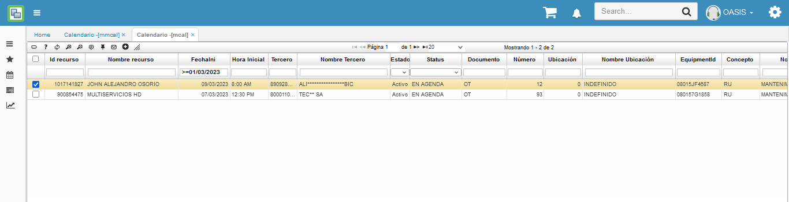
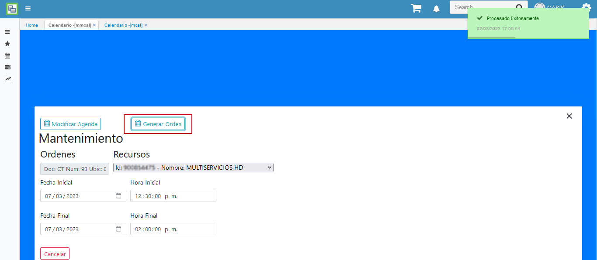
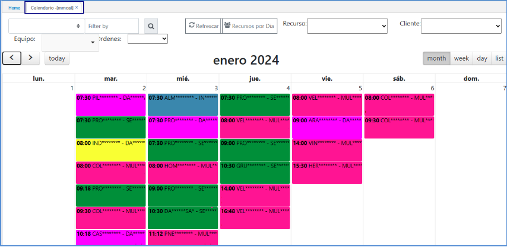
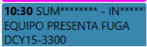
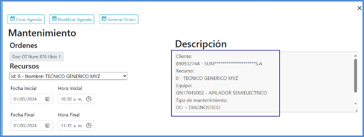
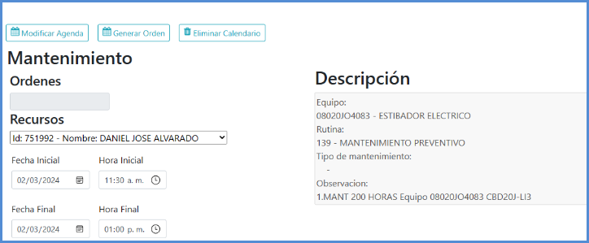

# MMCAL - Calendario

La opción MMCAL es la versión grafica del calendario [**MCAL - Calendario**](https://docs.oasiscom.com/Operacion/mrp/mantenimiento/mpreventivo/mcal) 

Permite visualizar la planeación realizada desde la opción [**MPGA - Generar Calendario**](http://docs.oasiscom.com/Operacion/mrp/mantenimiento/mpreventivo/mpga). 

Esta verificación que se realiza en el [**MMCAL - Calendario**](http://docs.oasiscom.com/Operacion/mrp/mantenimiento/mpreventivo/mpga) es únicamente para verificar información de los calendarios. 

Se valida en el **MMCAL - Calendario** que registro se encuentra por MANTENIMIENTO que es por [**GCAL - Calendario**](https://docs.oasiscom.com/Operacion/is/hospital/gcita/gcal) y por RUTINA que es por [**MORD - Ordenes de trabajo**](https://docs.oasiscom.com/Operacion/mrp/mantenimiento/morden/mord#mord---ordenes-de-trabajo)

Para el ejemplo se toma una casilla de una cita que este programada. 
 
 

 Al momento de hacer clic en el recuadro, automáticamente se abrirá una ventana emergente. 
Lo cual se puede ver que por la información este viene por RUTINA del **MORD - Ordenes de trabajo**.

Y si se consulta otro registro del calendario. Se puede visualizar que es por MANTENIMIENTO y viene por el **GCAL - Calendario**. 

