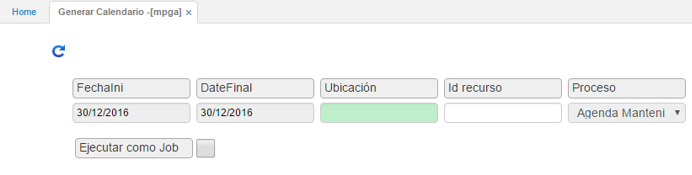

# MPGA - Generar Calendario

Luego de crear la rutina y el recurso, se procederá a la generación del calendario, el cual consiste en la planeación de las revisiones de rutina a cargo de un recurso. Esto se realiza a través de la aplicación **MPGA**.  

