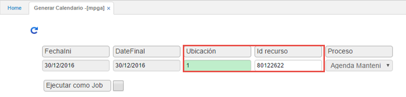
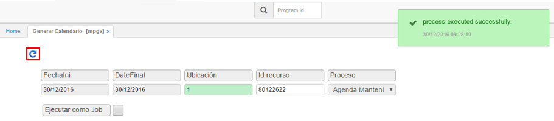

# MPGA - Generar Calendario

Luego de crear la rutina y el recurso, se procederá a la generación del calendario, el cual consiste en la planeación de las revisiones de rutina a cargo de un recurso. Esto se realiza a través de la aplicación **MPGA**.  

Ingresamos los datos de consulta.  

**FechaIni** y **DateFinal:** se muestran como deshabilitados dado que su diligenciamiento no aplica.  
**Ubicación:** se debe seleccionar la ubicación asignada a cada rutina.  
**Id recurso:** se debe ingresar el número de identificación del recurso al que se le realizará la generación de calendario.  
**Proceso:** lleva por defecto la opción _Agenda Mantenimiento_ por ende, este está deshabilitado.

Posteriormente se debe hacer click en el botón  , el cual se encargará de realizar la generación del calendario.  

Verifique el calendario generado en la aplicación [**Calendario**](http://docs.oasiscom.com/Operacion/mrp/mantenimiento/mpreventivo/mcal).  

