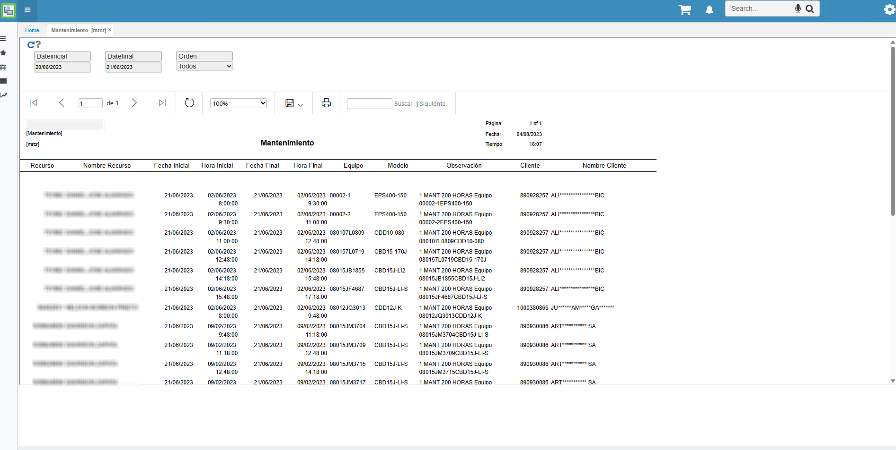

# MRCR REPORTE POR RECURSOS

Este reporte muestra todas las ordenes de mantenimiento, o si se desea
se puede filtrar por las ordenes de mantenimiento pendientes. 

En este reporte se filtra por un rango de fechas en el que se quiere identificar los mantenimientos dentro de ese rango de fecha. 

En el podrán ver el recurso asignado a ese mantenimiento, la información del equipo y el cliente al cual se le realiza el mantenimiento.
