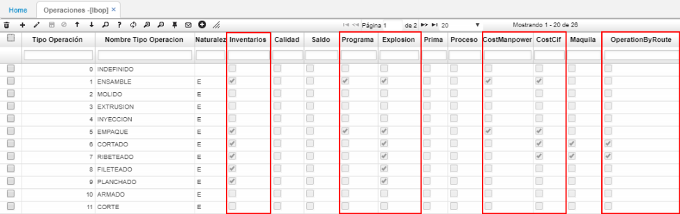

# OPERACIONES - LBOP

Igualmente, que los productos, debemos parametrizar las operaciones o procesos que se deben tener en cuenta para la obtención de nuestro producto terminado. Para esto ingresamos en la aplicación **LBOP** e ingresamos un nuevo registro con el id del proceso, el nombre del producto. Se deben tener en cuenta los siguientes campos para cuando se requiere tener mejor control en el proceso y costos del mismo:  

-	Inventarios: Se debe activar para que el sistema tenga en cuenta que debe realizar entradas y salidas de inventario de ese producto o insumo, por lo tanto, se debe activar para cada una de las operaciones. Este flag se puede dejar desactivado si no se requiere mover el inventario de los productos.  
-	Programa: Se requiere activar para la última operación del proceso de producción, con el fin de actualizar el campo “recibido” en la aplicación LPRG lo cual explicaremos más adelante.  
-	Explosión: Se debe activar dado que va relacionado con el flag de inventarios. Por lo tanto, se debe activar para todas las operaciones.  
-	CostManpower: Se debe activar para calcular en línea los costos de la mano de obra. Este flag sólo se debe activar a la última operación del proceso de producción.  
-	CostCIF: Se debe activar para calcular en línea los costos indirectos de fabricación. Este flag sólo se debe activar a la última operación del proceso de producción.  

