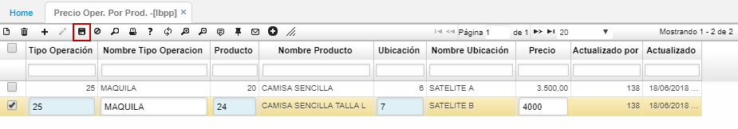

# LBPP - Precio operación por producto

La aplicación LBPP permite registrar y visualizar los valores de las operaciones por producto y ubicación (satelites).  

**Tipo Operación:** dar doble click y seleccionar del zoom el tipo de operación que se registra. Los tipos de operaciones se parametrizan en la aplicación [**LBOP - Operaciones**](http://docs.oasiscom.com/Operacion/mrp/produccion/lbasica/lbop).  
**Producto:** seleccionar del zoom el producto que se asocia a la operación que se desea registrar. Los productos son parametrizados en la aplicación [**BPRO - Productos**](http://docs.oasiscom.com/Operacion/common/bprodu/bpro).  
**Ubicación:** seleccionar del zoom la ubicación del producto.  
**Precio:** indicar el precio de la operación por el producto que se registra.  

Finalmente, damos click en el botón _Guardar_.  

