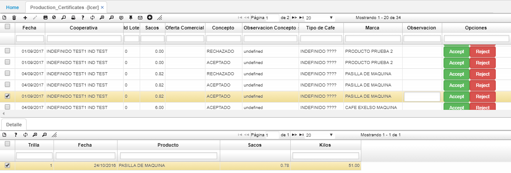
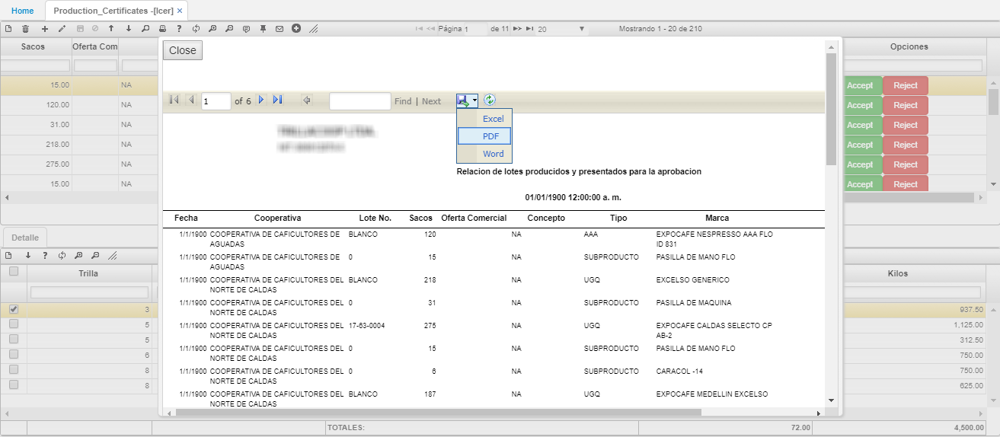

# LCER - Certificados de producción

La aplicación **LCER** permite asignar certificados de validacion de los lotes de café excelso aprobados por el exportador.  

La aplicación cuenta con dos botones para _Aceptar_ o _Rechazar_ el certificado. en el campo observación se deberá justificar brevemente el porqué se aprueba o rechaza el lote.  

La aplicación LCER cuenta con una vista previa que muestra por fecha los certificados de producción, con base a los datos del maestro. Para acceder damos click en el botón .  

