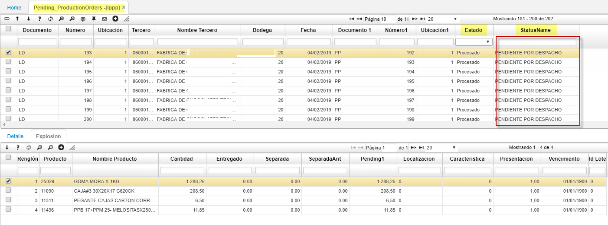

# LPPP - Ordenes Pendientes de Producción

La opción LPPP (Ordenes de Producción Pendientes) corresponde a una opción de solo consulta.
Esta opción mostrará los registros de la opción LPED, que se encuentren en estado diferente a TERMINADO.  

