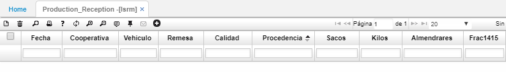

# LSRM - Recepción

La aplicación **LSRM** muestra un resumen de las remisiones de pergamino enviadas por cada cooperativa a la trilladora. Estas son expuestas en un portal para que puedan ser consultadas por los usuarios.  

