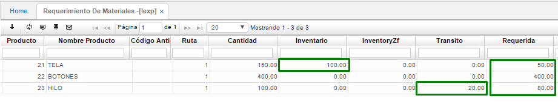
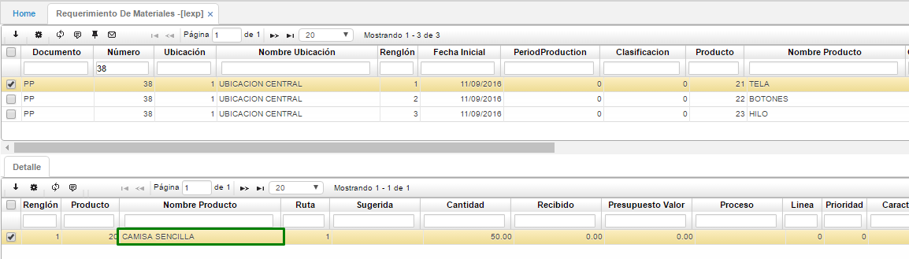

# REQUERIMIENTO DE MATERIALES - LEXP

En esta aplicación, consultamos el número del programa de producción que nos creó el sistema, en este caso el número 38. Aquí podemos ver 3 registros dado que se requieren 3 insumos para crear este producto, la cantidad de insumos requeridos para ese programa de producción y el sistema nos indica si se encuentran esos insumos en inventario, o en tránsito (se encuentran en orden de compra) o requerida (lo que se debe comprar).  

En el detalle de esta aplicación se podrá visualizar el producto que se creará bajo la materia prima mostrada anteriormente con sus respectivas características, cómo lo son el código del producto, la ruta, la cantidad a realizar, entre otros:  

Una vez tenemos la explotación del material y ya estamos listos para realizar el pedido de producción se ingresa a la aplicación **LPCP – Confirma plan**.  

