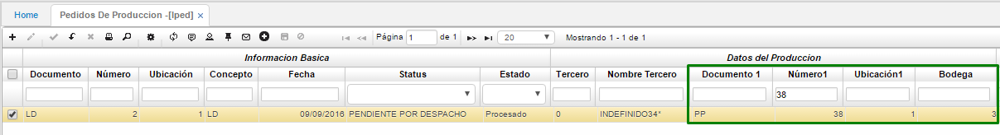
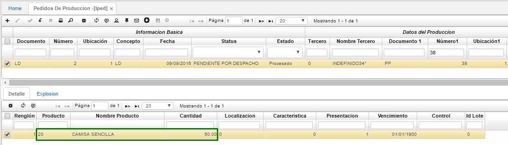
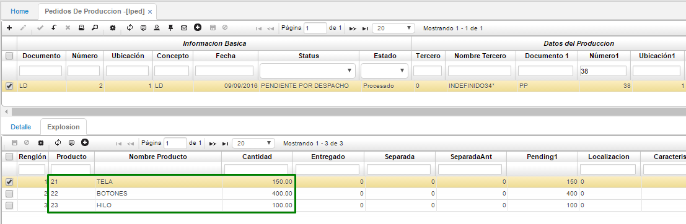
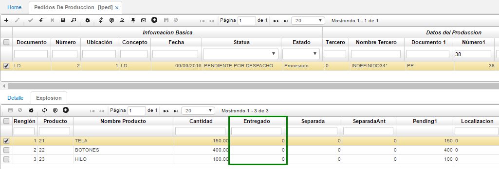
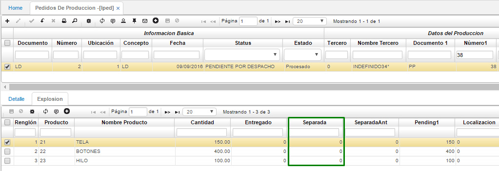
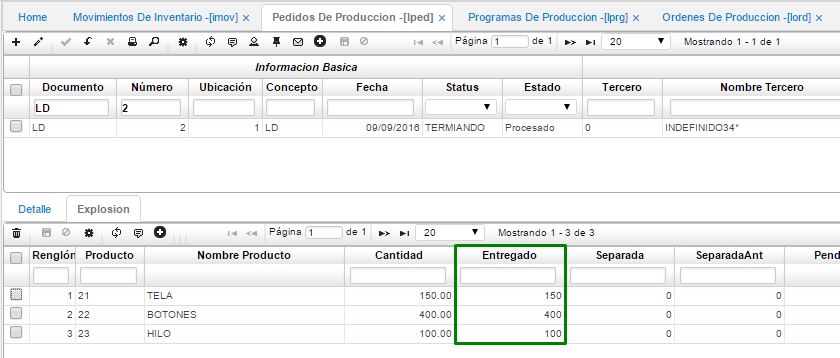

# PEDIDOS DE PRODUCCIÓN - LPED  

*   Al dar clic en el icono , el sistema genera automáticamente un pedido de producción de la fábrica a la bodega de materia prima, esto se puede visualizar en la aplicación LPED – pedidos con los insumos que se deberían trasladar a la bodega de materia prima.  
Este proceso valida la separación de mercancía para un pedido de producción según la fecha de vencimiento, **más próxima a vencer**.  

Cómo se puede observar en el recuadro verde el sistema crea el documento y en los campos Documento1, número1, ubicación1 y bodega arroja la información que se encuentra en el **programa de producción LPRG**.  

En el detalle nos muestra el producto y su respectiva cantidad a fabricar:  

En la pestaña explosión se pueden visualizar las materias primas o insumos para fabricar el producto anterior:  

Cabe resaltar que aquí es donde podemos identificar que insumos nos han entregado de la bodega con sus respectivas cantidades, en este ejemplo no han realizado entrega de ninguno de los insumos como lo podemos ver en la imagen: 

De igual manera si se realizó la respectiva parametrización para separar insumos nombrada en el numeral 6.1.4 en el recuadro en verde se podrá observar la cantidad de insumos separados.

Por otro lado, en la aplicación ISPL se puede visualizar los insumos reservados en el campo _“separada”_.

Una vez procesado el traslado en la aplicación **IMOV** se ingresa a la aplicación **LPED** validando en el detalle _“explosión”_ el campo entregado indica las unidades que han sido trasladadas y que ya se encuentran en planta.  

