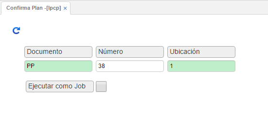

# CONFIRMA PLAN - LPCP

En esta aplicación, debems diligeciar 3 parámetros:  

-	Documento: _PP (Programa de producción)_  
-	Número: Número del programa de producción a generar  
-	Ubicación: Ubicación del programa de producción a generar  

