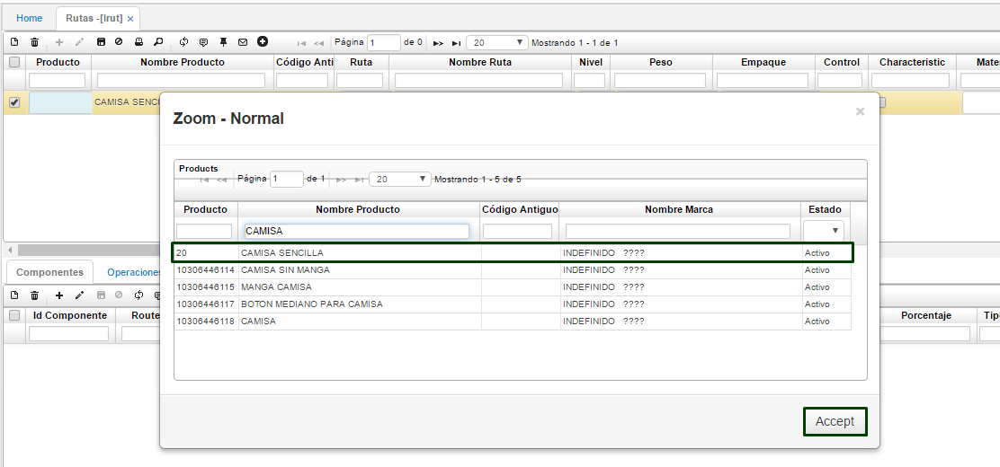
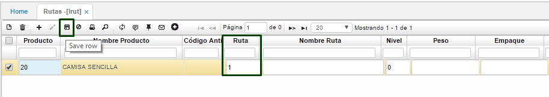
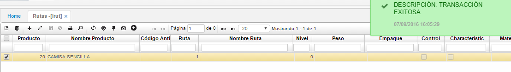
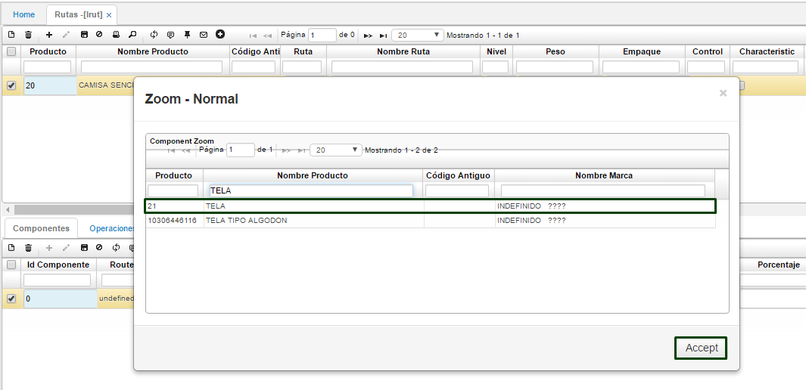
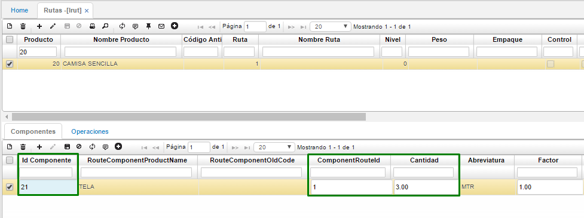
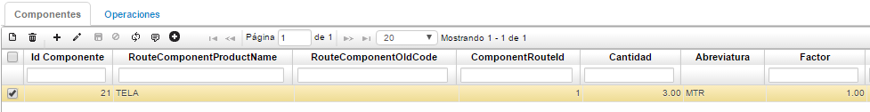
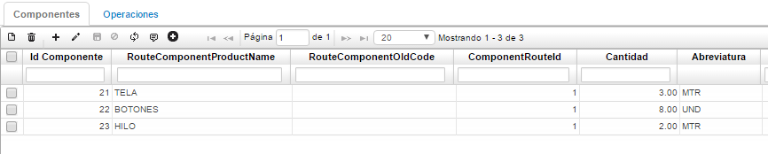
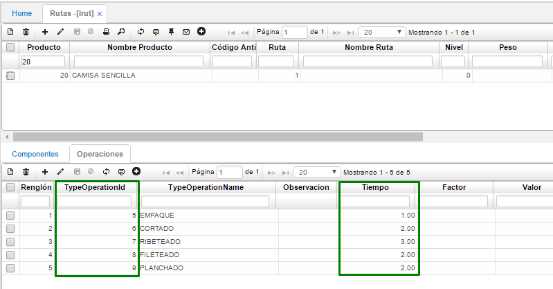

# RUTAS - LRUT

Una vez parametrizada la información en la aplicación **LBOP**, ingresamos a la aplicación **LRUT** en donde indicaremos qué insumos con sus respectivas cantidades y operaciones se requieren para realizar el producto, en este caso la camisa. Se debe crear un movimiento en el maestro con el número del producto y su ruta, todo producto en el sistema debe tener una ruta asociada, es posible que un producto tenga dos rutas es decir dos “recetas” para llegar al mismo producto. En este caso crearemos una sola ruta para el producto “Camisa sencilla” por lo tanto creamos en el maestro el producto, en el campo _producto_ podemos diligenciar el código del mismo, sino lo conocemos hacemos doble clic y el sistema nos abre una ventana emergente en donde nos aparecen todos los productos previamente parametrizados en **BPRO**, seleccionamos el registro requerido y damos clic en aceptar:  

Una vez seleccionado el producto indicamos el número de la ruta, en este caso 1 y guardamos el registro como lo vemos a continuación:  

Posteriormente creamos el detalle Componentes, en este ingresamos los registros requeridos, un registro pertenece a un insumo. En nuestro caso tenemos 3 insumos:  
-	Tela  
-	Botones  
-	Hilo  

Por lo tanto, creamos 3 registros con la cantidad requerida para realizar una unidad, es decir una camisa. Recuerda que estos insumos deben estar creados en el **BPRO** por lo tanto en el campo _Id Componente_ se diligencia el código del producto, pero si no se conoce se puede dar doble clic y el en seguida nos abre una ventana con el listado de los productos.  

Al dar aceptar el sistema nos arroja el código del insumo. De igual manera es necesario registrar la cantidad de ese producto.  Recuerda que en **BPRO** se parametrizó la unidad de medida para ese producto, en este caso es metros por lo tanto en el campo _cantidad_ diligenciaremos 3, referente a 3 metros. De igual manera en el campo _ComponentRouteId_ se debe diligenciar la cantidad de componentes.  

Al guardar el registro el sistema retorna los valores correspondientes a la información de este insumo, como lo vemos a continuación:  

Realizamos el ingreso de los demás insumos requeridos para realizar una camisa:  

Una vez diligenciada la información en la pestaña operaciones debemos registrar los procesos u operaciones que se deben realizar para obtener nuestro producto terminado. Recuerda que estos datos se deben parametrizar previamente en la aplicación LBOP. Adicionamos un registro nuevo y diligenciamos en el campo _Type Operation Id_ el Id de la operación en este caso el número 5, 6, 7, 8 y 9 con su respectivo tiempo. Por ejemplo, el proceso de corte de la tela para la camisa se demora 2 horas, por lo tanto, en el sistema en el campo _tiempo_ diligenciamos 2.  

