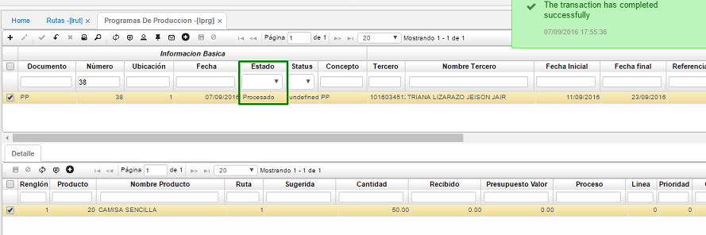

# PROGRAMAS DE PRODUCCION - LPRG

En esta aplicación vamos a crear los programas de producción, para esto adicionamos un registro en el maestro así:  

-	Documento: _PP_ Correspondiente a programa de producción  
-	Ubicación: 1 para este caso, pero se selecciona la requerida  
-	Fecha: Fecha del día de la creación del movimiento  
-	Concepto: _PP_ Correspondiente a programa de producción  
-	Tercero: Se diligencia el número de cédula del responsable del programa de producción.  
-	Fecha inicial: Se debe diligenciar la fecha en la que comienza el programa  
-	Fecha final: Se debe diligenciar la fecha en la que comienza el programa  

Por último, damos clic en guardar.  

En el detalle se debe registrar el producto que se producirá en ese programa de producción, recuerda que en un solo programa puedes tener varios productos a fabricar. En este caso sólo fabricaremos un producto (Camisas sencillas) pero deben salir 50 unidades, esto se debe especificar en el campo cantidad. Igualmente, que en las aplicaciones anteriores si no se recuerda el producto se puede hacer doble clic para que el sistema en una ventana adicional nos arroje los productos existentes y solo tenemos que seleccionar el requerido. También se debe especificar la ruta del producto previamente parametrizada en **LRUT - Rutas**.  

Una vez registrados los productos que se asociaran a ese programa de producción se procesa el maestro.

Al procesar este movimiento se genera la explotación de materiales la cual podemos observar en la aplicación **LEXP – requerimiento de materiales**. 

