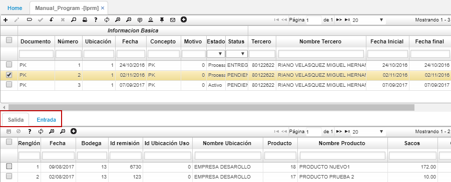
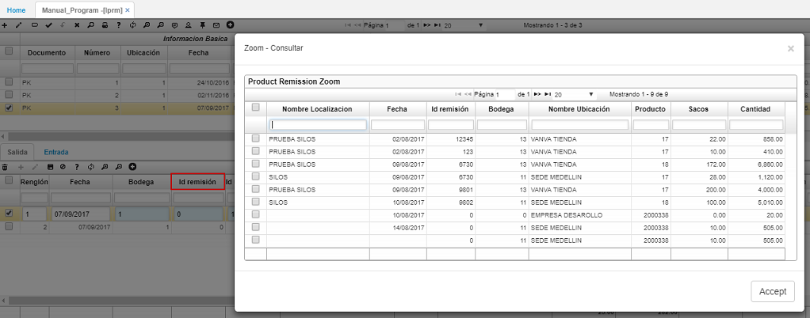
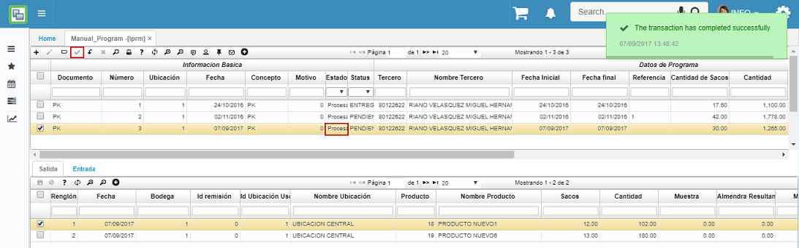

---
layout: default
title: Programa Manual
permalink: /Operacion/mrp/produccion/lprograma/lprm
editable: si
---

# LPRM - Programa Manual

La aplicación LPRM permite realizar la planeacion manual a un programa de produccion. Al poder hacer la planeacion manual, el usuario tiene la libertad de definir que productos se van a producir y los insumos que necesitará para realizar dicha producción.  

En el maestro de la aplicación se deberá especificar las características de la producción a planear y en el detalle, en la pestaña _Salida_, se relacionarán los insumos que se deberán utilizar para realizar los productos definidos en la siguiente pestaña _Entrada_.  



La pestaña _Salida_ cuenta con el campo **Id Remisión** el cual permite relacionar las remisiones asociadas a la recepción de la mercancía.  



Para confirmar la planeación del programa de producción se debe procesar el documento dando click en el botón  _Procesar_ ubicado en la barra de herramientas del maestro. El sistema arrojará un mensaje de control indicando que el documento ha sido procesado satisfactoriamente.  

