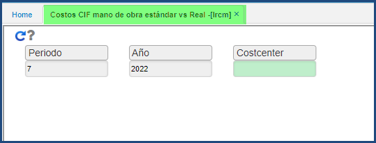
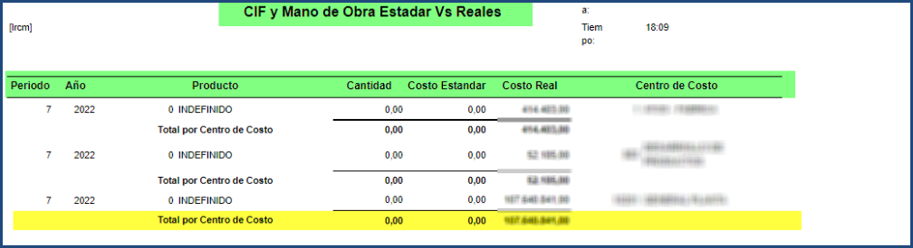

---

layout: default

title: Programa Manual

permalink: //Operacion/mrp/produccion/lreporte/lrcm

editable: si

---

# LRCM - Costo CIF mano de obra estándar vs Reales

la aplicación **LRCM** permite realizar un reporte de los costos de mano de obra estándar impactados y registrados en cada proceso productivo en un determinado periodo
vs los costos reales de producción como los gastos incurridos de producción registrados para dicho periodo. 

Se identifican tres criterios para general el reporte como lo son: Periodo, Año y Centro de Costo

Al ejecutar el reporte una ves finalizado con exito, retorna los productos utilizados, cantidad, costo estandar, costo real, centro de costo, totales consolidados al
final del reporte

