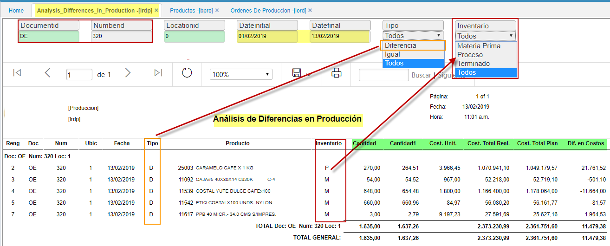

# LRDP - Análisis de Diferencias en Producción.

Reporte que permite la visualización y diferencias en cantidad según **LORD** Orden de produccion; estableciendo: costo unitario, costo total real, costo total plan y diferencias en costos. Campos resaltados en verde.

**Documento:** filtro del tipo de documento de la orden de producción, LORD.  

**Numero:** código del documento.  

**Ubicación:** parametrización del básico de documentos.  

**Fecha inicial y final:** Rangos de fechas a consultar.  

**Tipo:** filtros a realizar Diferencia, Igual, Todos.  

**Inventarios:** materia prima, proceso, terminado, *todos*. Esta parametrización se realiza en BPRO.  

