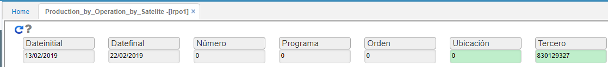
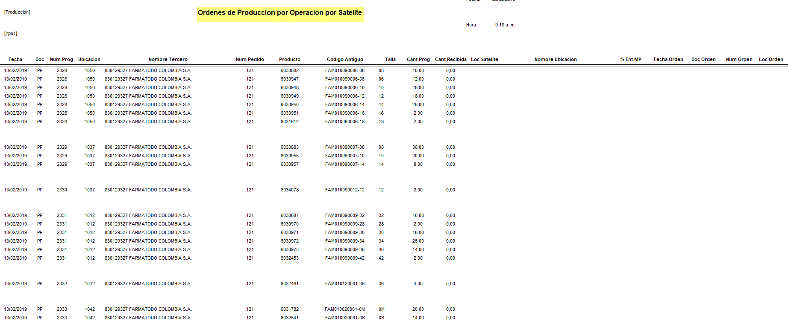

# LRPO1 - Producción por Operación por Satélite

Reporte que muestra las entregas de mercancia a los satelites por orden de produccion.  
* Fechas inicial y final:  rango de fechas de las ordenes realizadas en produccion.  
* Numero: consecutivo del documento.  
* Programa: orden realizada en **LPRG**.  
* Orden: proviene del documento realizado **LORD**.  
* Ubicacion: parametrizacion del **BUBI**.  
* Tercero:  empresa o tercero a quien se realiza la orden de produccion, segun **BTER**.  

