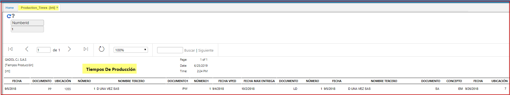

# LRTI - Tiempos De Producción.

El reporte Tiempos de producción **[LRTI]** donde se reflejan fechas y tiempos de generación y salida de insumos validando:
Pedidos de Producción **[LPED]** vs Movimientos de Inventario **[IMOV]** para seguimiento interno.  

**Fecha:** fechas del documento.  

**Documento:** tipo de documento de Programa de Producción.  

**Numero:** código del documento.  

**Ubicación:** parametrización del básico de ubicaciones.  

**Nombre Tercero:** a quien se ha realizado el pedido de produccion.  

**Documento1:** pedidos de stock parametrizacion del BDOC.  

**Numero1:** consecutivo del documento PW.  

**Fecha Vped:** dia, mes año del pedido.  

**Fecha max. entrega:** rango maximo dia, mes año del pedido.  

**Documento:** dia, mes año del pedido de produccion.  

**Numero:** dia, mes año del pedido.  

**Fecha:** dia, mes año.  

**Nombre Tercero:** a quien se ha realizado el pedido de produccion.  

**Documento:** tipo de documento del movimiento de inventarios.  

**Concepto:** parametrizacion del BDOC segun el movimiento de inventario.  

**Fecha:** dia, mes año del movimiento de inventario en IMOV.  

