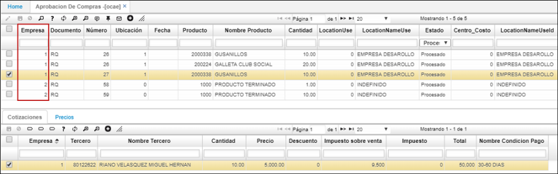
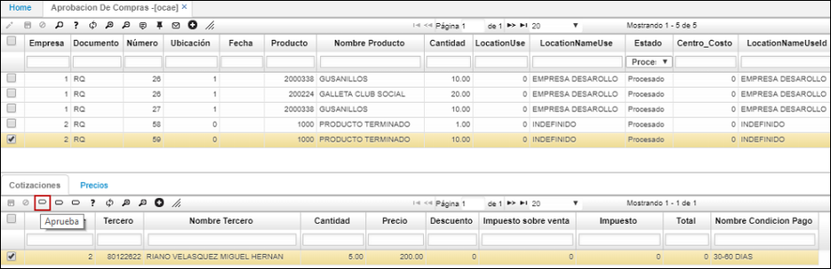
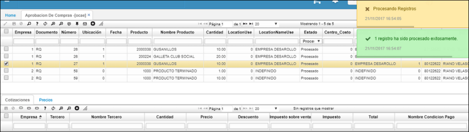

# OCAE - Aprobación de compras

La aplicación **OCAE** muestra la información de las compras pendientes de aprobación de todas las empresas a las que el usuario tenga permisos.  

En el campo _Empresa_ podemos ver que el usuario que se encuentra en sesión, tiene permisos para ver la información de las compras pendientes de aprobación de las empresas 1 y 2.  

En el detalle, se muestra la cotización asociada a dicho pedido de compra pendiente por aprobar. Para aprobar una compra, damos click en el siguiente botón del detalle.  

Al aprobarla, el sistema arrojará un mensaje de control indicando que la operación se realizó exitosamente.  

