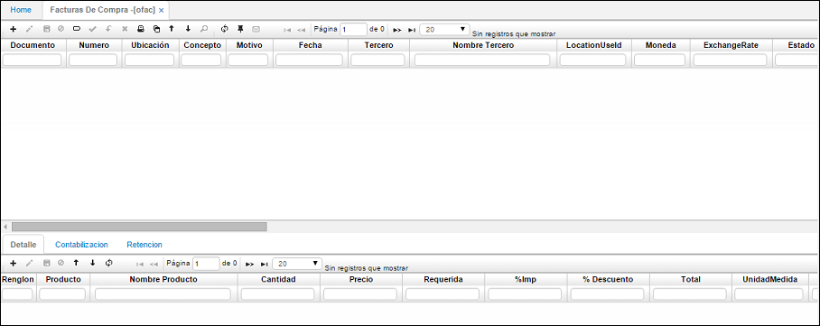

# Facturas de Compra - OFAC

La aplicación OFAC permite el registro de las facturas de compra, con todas sus características. La factura puede tener un recibo de inventario anterior, o generar el respectivo movimiento con la entrada de inventario.  

Cuando se procesa un documento de facturación de compras, y este tiene retención de ICA (ICR) el sistema llevará el dato de la ubicación geográfica a la tabla de contabilización. Se debe tener en cuenta si la retención de ICA aplicará por dirección en los documentos.  
 

 

En el maestro:

**Documento:** Nombre del tipo de documento a generar, puede ser factura, nota débito o crédito.  
**Número:** consecutivo asignado por el sistema, para las facturas de compra.  
**Ubicación:** Lugar donde se efectúa la factura de compra.  
**Concepto:** Nombre del concepto por el cual se genera la factura de compra.  
**Fecha:** Fecha de generación del documento.  
**Tercero:** Código del proveedor a quien se le hace la compra.  
**Nombre Tercero:** Nombre del proveedor a quien se le hace la compra.  
**Localización:** Lugar donde se efectúa la factura de compra.  
**Moneda:** Moneda en la cual se genera la factura de compra.  
**Estado:** Estado en el cual se encuentra la factura de compra.  
**Descuento #1 y #2:** Relación de los descuentos ofrecidos por el proveedor.  
**Condición Pago:** Forma como se efectuará el pago al proveedor.  
**Factura Char** Codigo alfanumerico que discrimina el serial de la factura proveeedor.  
**Vencimiento** Fecha editable de vencimiento de la factura, para pagos al proveedor.  
**Pronto Pago:** Descuento otorgado por el proveedor por cancelar la factura en determinado tiempo.  
**Bodega:** Bodega a la cual se hace la entrada de inventario.  
**Observación:** Con respecto a la factura de compra.  
**Fecha Factura:** este dato tipo fecha, se reflejara en los cruces **PMCR** campo vencimiento.  

En el detalle permite llevar el registro de los siguientes campos.

**Renglón:** Consecutivo que se genera de acuerdo al número de productos que viene en la factura.  
**Producto:** Código del producto que fue comprado.  
**Nombre Producto:** 	Nombre del producto que fue comprado.  
**Cantidad:** Cantidad recibida del producto comprado.  
**Precio:** Precio al que se compró el producto.  
**Requerida:**  
**%Imp:**	Porcentaje de impuesto.  
**% Descuento:** Porcentaje de descuento por producto.  
**Unidad Medida:** Unidad de medida de cada producto.  
**Localización Id:** Identificación de la localización de los productos en la bodega.  
**Localización:** Nombre de la localización de los productos en la bodega.  
**Característica:** Código de la característica que se puede atribuir al producto (Opcional).  
**Presentación:** Forma de presentación del producto (opcional).  
**Vencimiento:** Fecha de vencimiento del producto (Opcional).  
**Control:** Número de serial o consecutivo asignado a productos que vende la empresa y poder así identificarlos y llevar un control sobre ellos (Opcional).  
**Importaciones:** Número de la importación si la mercancía es importada.  
**Moneda:** Moneda en la cual se genera la factura de compra.  
**Observación:** Con respecto a la factura de compra.  
**Valores:** La tabla de valores muestra los estados por los que pasa el valor del producto desde su valor inicial pasando por descuentos, aplicación de impuestos hasta su valor real o final después de todos los ajustes necesarios hechos en la factura.  
**Proyecto:** Parametrizacion que se realiza en basico de proyectos **[BPRY]**.  
**AmortizePeriods:** numero de periodos donde se registran meses a amortizar el producto. ejemplo:  

*****
* En la pestaña **Presupuesto:**  
 Su funcionabilidad se establece apartir de la parametrizacion del documento: **[BDOC]**, concepto **[BCON]**, plantilla **[BPLA]** o en su defecto: 
 Se insertan los debitos que afectaran presupuestalmente, registrar los auxilires contable: centro costo, negocio, proyecto; como se ilustra.  
 
 
 
## [Pestaña Contabilización Resumida]  

Se crea la pestaña “contabilización resumida” donde se **totalizan** los valores de las cuentas parametrizadas.  
 

## [Manejo de IVA en Activos Fijos](http://docs.oasiscom.com/Operacion/scm/compras/ofactura/ofac#manejo-de-iva-en-activos-fijos)

De acuerdo a la normatividad vigente el rubro cancelado por concepto de IVA en los activos fijos hacen parte del valor del activo, pero también se debe tener presente dicho valor para la generación de medios magnéticos.  

De acuerdo a lo anterior, OASISCOM presenta el siguiente documento que nos ayudará a entender y parametrizar el sistema para que cumpla los dos requerimientos.  

### _Escenario 1_

### Ingreso de Activo Fijo por Compras (OFAC)

Para poder realizar los movimientos en el sistema es necesario realizar las siguientes parametrizaciones previamente:  

1. En la aplicación [**BCOD - Códigos de Cuentas**](http://docs.oasiscom.com/Operacion/common/bcuenta/bcod#parametrización-ingreso-de-activo-fijo-por-compras), validar que se encuentre creado el código IVC o crearlo en caso que no esté. (_Ver aplicación_)  
2. En la aplicación [**BPLA - Plantillas**](http://docs.oasiscom.com/Operacion/common/bcuenta/bpla#parametrización-ingreso-de-activo-fijo-por-compras), incluir en la plantilla del documento _FP x FP_ el código IVC. (_Ver aplicación_)  
3. En la aplicación [**BGRU - Grupos**](http://docs.oasiscom.com/Operacion/common/bcuenta/bgru#parametrización-ingreso-de-activo-fijo-por-compras), incluir el código IVC a los activos fijos. (_Ver aplicación_)

Realizada la parametrización continuaremos a generar el movimiento.  

Adicionamos un nuevo registro (+):  

**Documento:**  FP  
**Concepto:**  FP  
**Fecha:** la fecha de la factura  
**Tercero:** Se puede buscar a través del zoom, los datos del proveedor (número de identificación y nombre)  
**Factura Char:** el número de la factura del proveedor  
**Observación:** En caso de que se requiera

Y le damos guardar

En este caso se realiza la compra de 2 activos fijos, uno por $1.000.000 + IVA y otro por $500.000 + IVA

El sistema causa el valor del activo separado del valor del IVA, pero llevando al módulo el valor total del activo (Costo + IVA).

Podemos ver que el sistema creó automáticamente los activos 2 y 3.

Finalmente, si consultamos los activos en la aplicación [**HSSP - Saldos de Activos**](http://docs.oasiscom.com/Operacion/erp/activos/hsaldo/hssp#ingreso-de-activo-fijo-por-compras-ofac) veremos que estos se encuentran valorizados por el Costo + IVA. (_Ver aplicación_)

Con lo anterior ya se encuentra:
* Causación factura compra
* Creación del Activo Fijo
* Ingreso del activo fijo por el valor del costo + IVA

Ahora es necesario validar la generación de medios magnéticos, para ello se deberá parametrizar como se explica la aplicación [**KBFO - Formatos**](http://docs.oasiscom.com/Operacion/erp/contabilidad/kbasica/kbfo#parametrización-para-generación-de-medios-magnéticos-correspondientes-al-ingreso-de-activo-fijo-por-compras).

### _Escenario 2_

### Ingreso de Activo Fijo por HMOV

La explicación del _Escenario 2_ se puede ver en la aplicación [**HMOV - Movimientos**](http://docs.oasiscom.com/Operacion/erp/activos/hmovimient/hmov#manejo-de-iva-en-activos-fijos)

## [Contabilización de Fletes](http://docs.oasiscom.com/Operacion/scm/compras/ofactura/ofac#contabilización-de-fletes)

Configurado el concepto correctamente en la aplicación [**BDOC - Documentos**](http://docs.oasiscom.com/Operacion/common/bsistema/bdoc#parametrización-de-fletes), se procede a crear la factura de compra por el respectivo concepto diligenciando el precio del flete.  

El resultado se verá reflejado en la pestaña _Contabilización_ del detalle:

## [Control por Proveedor](http://docs.oasiscom.com/Operacion/scm/compras/ofactura/ofac#control-por-proveedor)

En OasisCom se permite generar un número de control por cada proveedor. El número de control será el mismo independiente de los diferentes productos que ofrezca el proveedor, si el proveedor cambia se debe asignar un número de control para el nuevo proveedor. En la aplicación [**BCNS - Consecutivos**](http://docs.oasiscom.com/Operacion/common/bsistema/bcns) filtrando con el documento CL se puede verificar el número de consecutivo en que se entra el control.   

Para asignar el número de control primero se debe crear la siguiente variable en la aplicación [**WVAR - Variables**](http://docs.oasiscom.com/Operacion/dss/bsc/wbasica/wvar).  

Seguidamente, el la aplicación [**BPRO - Productos**](http://docs.oasiscom.com/Operacion/common/bprodu/bpro) debemos validar que los productos tengan activo el check _Control_.  

En la aplicación [**BDOC- Documentos**](http://docs.oasiscom.com/Operacion/common/bsistema/bdoc) se debe verificar que el concepto del movimiento tenga asignado en el campo _Clase_ la opción _**Control X Lote**_.  

Con la parametrización anterior procedemos a generar una factura de compra. Al procesar se asignará el número de control.  

Finalmente, en la aplicación **BCNT - Controles** podemos consultar los números de controles que han sido creados y el número de identificación del proveedor al cual se encuentra asignado.  

* **Importante:** El sistema validara la RETENCION acumulada diaria, por cada una de las ubicaciones en **OFAC** que esten procesados, realizando la sumatoria  acumulanda; si aplica y es base de retencion esta se vera reflejada contablemente en la ultimo documento **OFAC**.  
