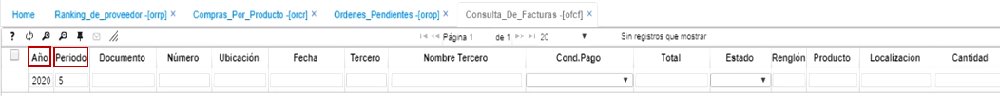
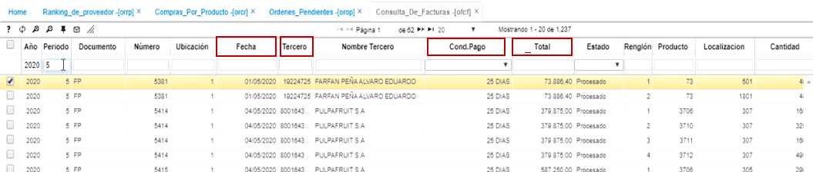

# Consulta de faturas - OFCF  

Esta es una aplicación tipo consulta en donde en un periodo determinado, se listan las facturas por proveedor realizadas en dicho periodo.  Los filtros de la parte superior, son los que permiten visualizar la información de la mejor manera, dependiendo del dato que quiera filtrar, puede ser por fecha, por tercero, por condición de pago, por valor total o por cualquier otro de los campos de esta aplicación permitidos.  

  

