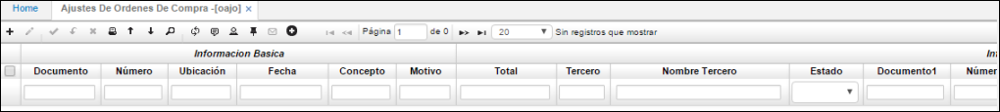

# Ajustes de Órdenes de Compra - OAJO

Esta aplicación permite el registro de las modificaciones y/o ajustes realizados a las órdenes de compra, cuando así se requiera.  

**Documento:** Nombre del documento.  
**Número:** Consecutivo de ajustes de órdenes de compra.  
**Ubicación:** Numero de Ubicación donde se generar el ajuste de compra.  
**Concepto:** Nombre de concepto.  
**Fecha:** fecha en la que se realiza el ajuste de compra.  

