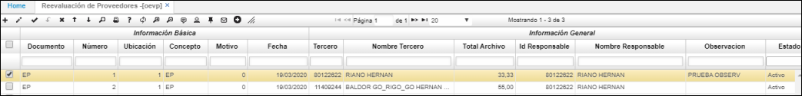
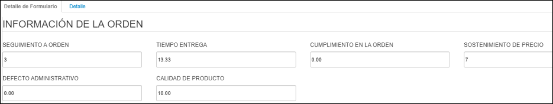
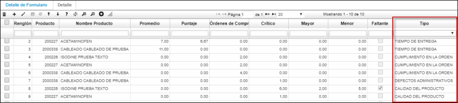
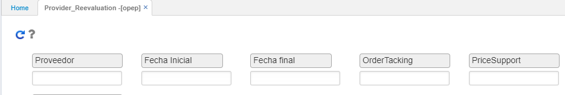
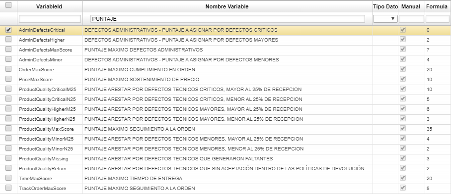
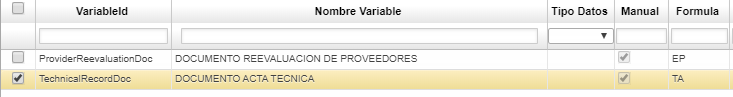
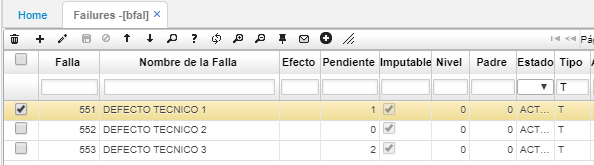

---

layout: default

title: Reevaluación Proveedores

permalink: /Operacion/scm/compras/oorden/oevp

editable: si

---

# Reevaluación de Proveedores - OEVP

**Datos Generales:** En el maestro del documento de la opción [**OEVP**] se podrán ver los datos generales como el proveedor que se ha evaluado, la fecha de la evaluación, responsable que ejecuto el proceso y el puntaje total obtenido por el proveedor. Los documentos que generemos en esta opción quedaran en estado Activo.  
Dividiendo este, en periodo de reevaluación, observaciones, productos negociados, reevaluación por criterios y en grandes categorías como lo son calidad del servicio.  

  

**Valores Generados:** En la pestaña *“Detalle de Formulario”* se podrán ver los valores finales para cada una de las variables involucradas en el proceso.  

**Detalle de los Cálculos:** En la pestaña *“Detalle”* se podrán ver los datos calculados para cada una de las variables del proceso. El campo **"Tipo"** se podrán identificar los datos correspondientes a cada una de las variables.
  

******

# Provider_Reevaluation - OPEP  

**Parámetros del Proceso:** El proceso recibirá como parámetros el Código del Proveedor, Fecha Inicial y Fecha Final a ser evaluada y los valores para las variables Seguimiento a la Orden y Sostenimiento de Precio.

  

**Proceso:** Al ejecutar el proceso el sistema hará algunas validaciones sobre el proveedor y  los valores máximos que pueden tener las variables pasadas por parámetro.  Luego verificara si el proveedor tiene actas técnicas procesadas en el rango de fechas indicado y si estas existen, iniciara la evaluación de cada una de las variables involucradas en el proceso.

Los datos que se vayan calculado y generando se irán dejando en las tablas respectivas que se mostraran en la opción [**OEVP**], donde se generara un documento con la fecha de ejecución del proceso y los datos correspondientes del proceso.

Una vez culminado exitosamente el proceso, los datos calculados y generados se podrán revisar en la opción [**OEVP**].

***
**PARAMETRIZACIÓN:** Se debe crear un documento nuevo con las siglas **EP**, para la opción [**OEVP**]. Se  deben crear tambien las siguientes variables en [**WVAR**] para el control del proceso.

  

  

Para los cálculos de la última variable del proceso **“Calidad del Producto”** es necesario parametrizar los **(Defectos)**, esto se hace configurando el campo **"Pendiente"** en la opción [**BFAL**]  de la siguiente forma:
- ***Valor 1:*** Para aquellos defectos técnicos que generan faltantes,
- ***Valor 2:*** Para los defectos que implican "sin aceptación dentro de las políticas de devolución".
  

