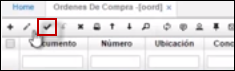
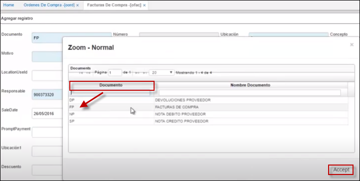
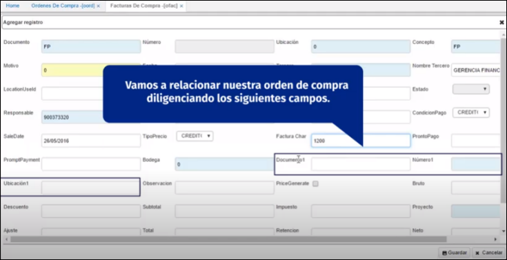
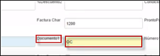
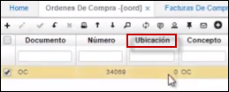
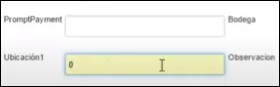
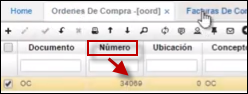
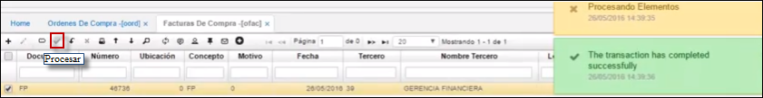

---

layout: default
title: Ordenes de Compra
permalink: /Operacion/scm/compras/oorden/oord
editable: si

---

# Órdenes de Compra - OORD

>+ [**Cómo relacionar una orden de compra con una factura**](http://docs.oasiscom.com/Operacion/scm/compras/oorden/oord#cómo-relacionar-una-orden-de-compra-con-una-factura)

>+ [**Precio unitario en orden de compra**](http://docs.oasiscom.com/Operacion/scm/compras/oorden/oord#precio-unitario-en-orden-de-compra)

>+ [**Generación código de barras**](http://docs.oasiscom.com/Operacion/scm/compras/oorden/oord#generación-código-de-barras)

En la sección maestro de la aplicación, permite realizar el registro y control de las órdenes de compra.  

+ **Documento:** Nombre del documento.  
+ **Numero:** Número consecutivo de orden de compra. El programa lo asigna automáticamente.  
+ **Ubicación:** Identificación y nombre del lugar desde donde se efectúa la orden de compra.   
+ **Fecha:** Fecha cuando se efectúa la orden. El sistema asigna la fecha actual por defecto.  
+ **Tercero:** Código del proveedor a quien se le envía la orden de compra.  
+ **Nombre Tercero:** Nombre del proveedor a quien se le envía la orden de compra. 
+ **Localización:** Identificación y nombre del lugar desde donde se efectúa el requerimiento de compra.  
+ **Moneda:** Moneda en la cual se va cancelar los productos.  
+ **Exchange Rate:** Tipo de cambio.  
+ **Estado:** Estado o fase en el que se encuentra la orden de compra.  
+ **% Descuento 1 y 2:** Descuentos que otorgó el proveedor por la orden de compra.  
+ **Condición Pago:** Forma como se efectuará el pago al proveedor.  
+ **Pronto Pago:** % de descuento por realizar pago antes de lo estipulado.  
+ **PromptPayament:** % de descuento por realizar pago el día estipulado.  
+ **Requerimiento:** Número consecutivo del correspondiente requerimiento.  
+ **Fecha de entrega Minima:** Fecha minima de entrega de la orden.  
+ **Fecha de entrega Maxima:** Fecha Máxima de Entrega de la Orden.  
+ **Observación:** Con respecto a la orden de compra.  

En el detalle del **OORD**, se relaciona la descripción de los productos requeridos por la empresa y se están solicitando al proveedor.  

+ **Renglón:** Número de cada fila de pedido de productos a solicitar dentro del requerimiento.  
+ **Producto:** Código del producto que se requiere.  
+ **Nombre Producto:** Nombre del producto que se requiere.  
+ **Cantidad:** Cantidad requerida del producto.  
+ **Precio:** Precio al que se va a comprar el producto.  
+ **%Imp:** Porcentaje de impuesto.  
+ **% Descuento:** Porcentaje de descuento por producto.  
+ **Total:** Valor total de cada producto.  
+ **Unidad Medida:** Unidad de medida de cada producto.  
+ **Recibida:** Número de productos recibidos.  
+ **Requerimiento:** Identificación del requerimiento correspondiente.  
+ **Estado:**	Estado en el que se encuentra cada producto.  
+ **Característica:** Código de la característica que se puede atribuir al producto (Opcional).  
+ **Presentación:** Forma de presentación del producto (Opcional).  
+ **Vencimiento:** Fecha de vencimiento del producto (Opcional).  
+ **Control:** Número de serial o consecutivo asignado a productos que vende la empresa y poder así identificarlos y llevar un control sobre ellos (Opcional).  
+ **Fecha de entrega:** Fecha en la cual se hace la entrega de los productos requeridos.  
+ **Proyecto:** Parametrizacion que se realiza en basico de proyectos **[BPRY]**.  

En la pestaña **Presupuesto:**  

Su funcionabilidad se establece apartir de la parametrizacion del documento: **[BDOC]**, concepto **[BCON]**, plantilla **[BPLA]** o en su defecto: 

 Se insertan los debitos que afectaran presupuestalmente, registrar los auxilires contable: centro costo, negocio, proyecto; como se ilustra.  

 

   

 

 

## [**Cómo relacionar una orden de compra con una factura**](http://docs.oasiscom.com/Operacion/scm/compras/oorden/oord#cómo-relacionar-una-orden-de-compra-con-una-factura)  

 

 En la aplicación **OORD**, se adiciona un nuevo registro (+), se abre el zoom en el campo **_Documento_** y se selecciona la opción **_OC_** de Ordenes de compra, en el campo **_Ubicación_** Cero (0) y en el campo **_Concepto_** también **_OC_** de Ordenes de compra, en el campo **_Motivo_** Cero (0), en el campo **_Tercero_** se selecciona el tercero (también con el Zoom) al que le se le realiza la orden de compra, en el campo **_Condición pago_** la forma cómo se realiza el pago y se guarda el registro.  

 

 

  

  

  

Ahora, se procede a realizar el detalle.  Se adiciona un nuevo registro (+).  En el campo **_Producto_** se selecciona del Zoom el producto deseado; el campo **_Cantidad_** se diligencia de acuerdo con la necesidad y el campo **_Precio_** con el valor y se guarda.  

  

Ahora, se procede a procesar  

  

  

En este momento, se ingresa a la aplicación [Facturas de compra - OFAC](http://docs.oasiscom.com/Operacion/scm/compras/ofactura/ofac).  En el campo **_Documento_** se selecciona **_FP_** de Facturas de compra, en el campo **_Ubicación_** Cero (0) y en el campo **_Concepto_** también **_FP_** de Facturas proveedor, en el campo **_Motivo_** cero (0) de indefinido, en el campo **_Tercero_**, se busca y selecciona el mismo tercero de la Orden de compra, en los campos **_CondiciónPago_** y **_TipoPrecio_** el método de pago, en el campo **_FacturaChar_** se tiene la posibilidad de insertar el prefijo o código que se utiizará en las facturas; claramente eso varía según la empresa.  

  

Ahora, se va a relacionar la Orden de compra al diligenciar los siguientes campos:  

  

Se regresa a la Orden de compra y se verifica el **_Documento_** que se tiene:  

  

Luego, se verifica el campo **_Ubicación_** en la Orden de compra  

  

Después de diligenciar estos dos campos, se abre el Zoom en el campo **_Número1_** y se selecciona la Orden de compra;en caso de que no se sepa cuál es, se regresa a la aplicación **OORD** y se verifica el número  

  

Después de diligenciar estos campos, se guarda el registro.  Como se puede ver en el ejemplo, automáticamente carga el detalle con los mismos datos de la Orden de compra; lo que evidencia que hizo la relación correctamente.  

  

En este momento, se procesa el Documento

## [**Precio unitario en orden de compra**](http://docs.oasiscom.com/Operacion/scm/compras/oorden/oord#Precio-unitario-en-orden-de-compra)

Este proceso permite que al generar una nueva orden de compra de un mismo proveedor se llame el ultimo precio actualizado que se generó por última compra.

Para esto se debe ingresar a la aplicación **Órdenes de Compra – OORD**, buscar el documento del cual se necesita identificar el número de producto.

Luego de tomar el número de producto se debe ingresar a la aplicación [**OPRE - Precios**](https://docs.oasiscom.com/Operacion/scm/compras/oprecio/opre), e ingresar el número de producto que se tomó primeramente del **Órdenes de Compra – OORD**.

Cuando se termina este proceso se puede evidenciar el ultimo precio actualizado que se tuvo que haber generado de la última compra teniendo en cuenta el tercero, como se muestra en la imagen el valor de 490.00

## [**Generación código de barras**](http://docs.oasiscom.com/Operacion/scm/compras/oorden/oord#generación-código-de-barras)

Debe ingresar a [**SCAM - Campos**](https://docs.oasiscom.com/Operacion/system/sconfig/scam), en la imagen se puede visualizar cada campo y como se encuentra parametrizado OORD - Órdenes de compra [**OORD - Ordenes de compra**](https://docs.oasiscom.com/Operacion/scm/compras/oorden/oord) y [**BPRO - Productos**](https://docs.oasiscom.com/Capacitacion/Empower/bpro)

Una vez que ya hayan validado el [**SCAM - Campos**](https://docs.oasiscom.com/Operacion/system/sconfig/scam) , el botón de Generar código de barra se encuentra en la aplicación [**BPRO - Productos**](https://docs.oasiscom.com/Capacitacion/Empower/bpro), se puede visualizar con el primer registro, al seleccionar este producto lo que se realiza por consiguiente es presionar el botón de “Generar código de barra” y una vez ya ejecutado el botón, se creara automáticamente el código de barras. 

 
Existe un botón de Multipreview que se encuentra ubicado en el [**OORD - Ordenes de compra**](https://docs.oasiscom.com/Operacion/scm/compras/oorden/oord) , en el cual se puede visualizar el reporte del código de barra. 

Al momento de ejecutar el botón de Multipreview, se refleja una opción nombrada **Imprimir Barcode** y al momento de presionar muestra una ventana emergente  saldrá el código de barras. 

