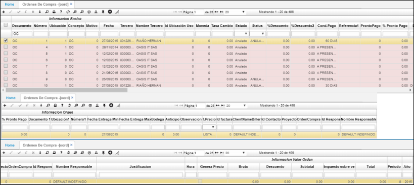

---

layout: default
title: Ordenes de Compra
permalink: /Operacion/scm/compras/oorden/oord
editable: si
---

# Órdenes de Compra - OORD

En la sección maestro de la aplicación, permite realizar el registro y control de las órdenes de compra.  

•	**Documento:** Nombre del documento.  
•	**Numero:** Número consecutivo de orden de compra. El programa lo asigna automáticamente.  
•	**Ubicación:** Identificación y nombre del lugar desde donde se efectúa la orden de compra.  
•	**Fecha:** Fecha cuando se efectúa la orden. El sistema asigna la fecha actual por defecto.  
•	**Tercero:** Código del proveedor a quien se le envía la orden de compra.  
•	**Nombre Tercero:** Nombre del proveedor a quien se le envía la orden de compra.  
•	**Localización:** Identificación y nombre del lugar desde donde se efectúa el requerimiento de compra.  
•	**Moneda:** Moneda en la cual se va cancelar los productos.  
•	**Exchange Rate:** Tipo de cambio.  
•	**Estado:** Estado o fase en el que se encuentra la orden de compra.  
•	**% Descuento 1 y 2:** Descuentos que otorgó el proveedor por la orden de compra.  
•	**Condición Pago:** Forma como se efectuará el pago al proveedor.  
•	**Pronto Pago:** % de descuento por realizar pago antes de lo estipulado.  
•	**PromptPayament:** % de descuento por realizar pago el día estipulado.  
•	**Requerimiento:** Número consecutivo del correspondiente requerimiento.  
•	**Fecha de entrega:** Fecha Máxima de Entrega de la Orden.  
•	**Observación:** Con respecto a la orden de compra.  

Se relaciona la descripción de los productos requeridos por la empresa y se están solicitando al proveedor.  

•	**Renglón:** Número de cada fila de pedido de productos a solicitar dentro del requerimiento.  
•	**Producto:** Código del producto que se requiere.  
•	**Nombre Producto:** Nombre del producto que se requiere.  
•	**Cantidad:** Cantidad requerida del producto.  
•	**Precio:** Precio al que se va a comprar el producto.  
•	**%Imp:** Porcentaje de impuesto.  
•	**% Descuento:** Porcentaje de descuento por producto.  
•	**Total:** Valor total de cada producto.  
•	**Unidad Medida:** Unidad de medida de cada producto.  
•	**Recibida:** Número de productos recibidos.  
•	**Requerimiento:** Identificación del requerimiento correspondiente.  
•	**Estado:**	Estado en el que se encuentra cada producto.  
•	**Característica:** Código de la característica que se puede atribuir al producto (Opcional).  
•	**Presentación:** Forma de presentación del producto (Opcional).  
•	**Vencimiento:** Fecha de vencimiento del producto (Opcional).  
•	**Control:**	Número de serial o consecutivo asignado a productos que vende la empresa y poder así identificarlos y llevar un control sobre ellos (Opcional).  
•	**Fecha de entrega:** Fecha en la cual se hace la entrega de los productos requeridos.  

