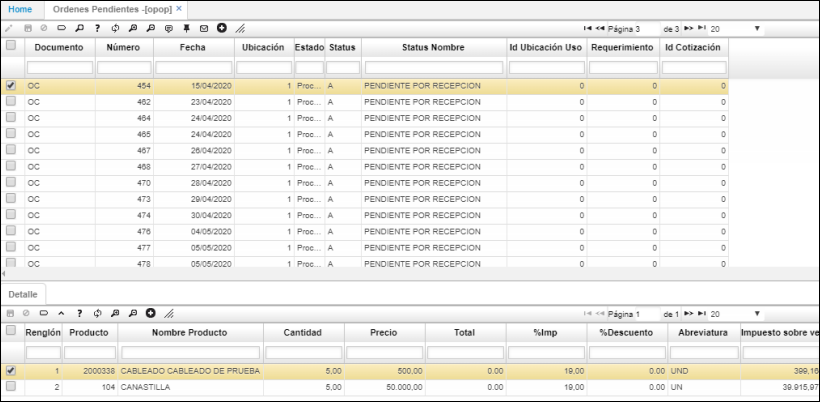
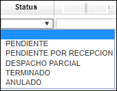
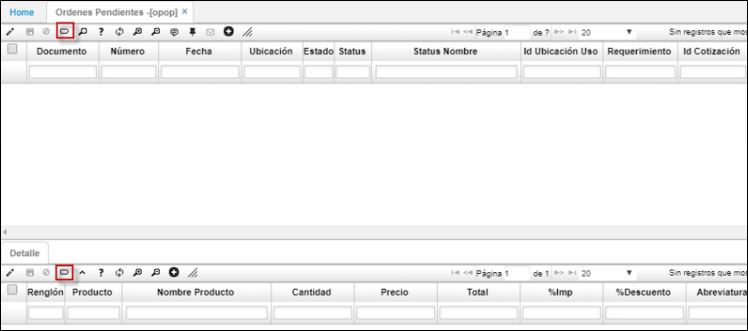
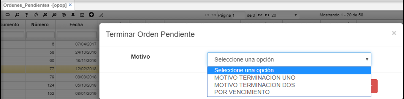
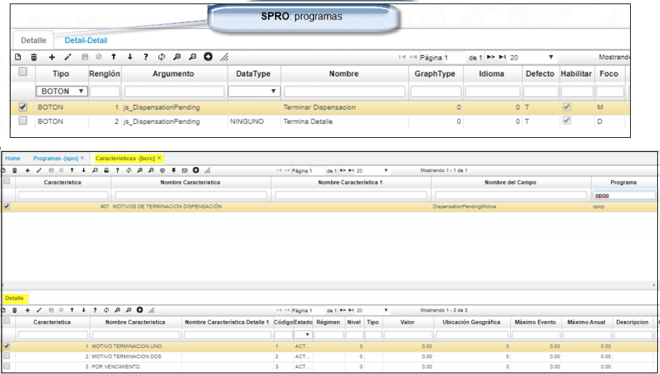

---

layout: default

title: Ordenes Pendientes

permalink: /Operacion/scm/compras/oorden/opop

editable: si

---

# Órdenes Pendientes - OPOP

Permite validar los registros realizados de las órdenes de compra con status: pendiente. Tipo consulta.  

**Documento:** Nombre del documento (OC).  
**Numero:** Número consecutivo de orden de compra. El programa lo asigna automáticamente.  
**Ubicación:** Identificación y nombre del lugar desde donde se efectúa la orden de compra.  
**Fecha:** Fecha cuando se efectúa la orden. El sistema asigna la fecha actual por defecto.  
**Estado:** Estado o fase en el que se encuentra la orden de compra.  
**Status:** Status fase en el que se encuentra la orden de compra.  
  

Existen dos formas para terminar una orden:  
Desde el **maestro** o por cada uno de los item en el **detalle**.  
Al ejecutar el boton indicado (terminar_dispensacion)*, se aplicara para todo el documento.  

  
* Para el primer caso desde el maestro:le indicaremos el motivo por el cual terminamos la orden.  
  

* Para terminar un ítem (detalle) se puede indicar el motivo por el cual se terminó, se crean lista desplegable del BCRC.  
	Se debe de realizar la siguiente parametrizacion desde el **SPRO** y desde las caracteristicas **BCRC**.  
	  

