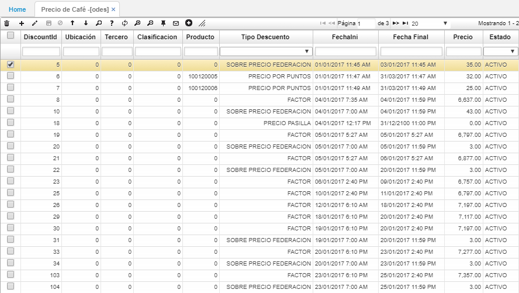

# ODES - Precio de Café

En la aplicación **ODES** se debe registrar diariamente el precio del café por cada producto, ya que este es actualizado de igual manera por la bolsa.  

**Discount Id:** asignar un consecutivo manualmente al registro.  
**Ubicación:** si el precio que se registra aplica para toda la cooperativa en general digitamos el número 0. De no ser así, ingresamos una ubicación específica.  
**Tercero:** si se desea aplicar un precio a un tercero en específico, se debe ingresar el número de identificación del mismo, de no ser así digitar 0.  
**Clasificación:** si el precio se asignará por clasificación de productos, indicar el número de clasificación.  
**Producto:** en caso que el precio sea asignado de acuerdo al producto, se debe indicar el id del producto.  
**Tipo Descuento:** para la compra de café por factor, se deberá seleccionar el tipo de descuento _Factor_.  
**Fecha inicial y Fecha final:** indicar la fecha inicial y final en la que aplicará el precio registrado.  
**Precio:** indicar el precio del día de acuerdo a la bolsa.  
**Estado:** seleccionar estado _Activo_.  

