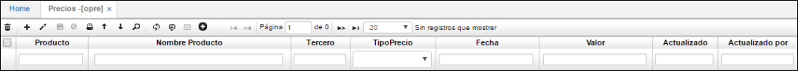

# Precios - OPRE

Permite el registro de los precios de compra, diferenciados por fecha y proveedor. Así como también se mantiene el histórico de precios del mismo producto, para el estudio de su comportamiento o valoración, y es útil en las devoluciones de productos comprados.

•	**Tercero:** Identificación y nombre del proveedor.  
•	**Producto:** Código y nombre del producto.  
•	**Fecha:** Fecha de vigencia del precio del producto.  
•	**Valor:** Precio del producto.  

