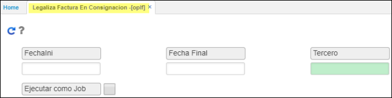

# OPLF - Lagaliza Factura en Consignación.  
PROCESO ESPECIAL.

La aplicación **OPLF** pertenece al modulo de compras y aplica para aquella mercancía en consignación que se han vendido para posteriormente facturarle al proveedor. Este proceso genera una factura de compra OFAC.  
Previa parametrización de cada uno de los productos en BPRO; se marca que sea en consignación y se agrega tercero a dicho producto.  
Se realiza adecuacion agregando calendario en los campos fecha inicial y fecha final; datos de entrada.  

  

