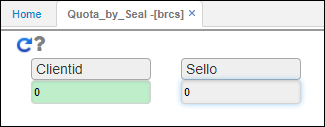
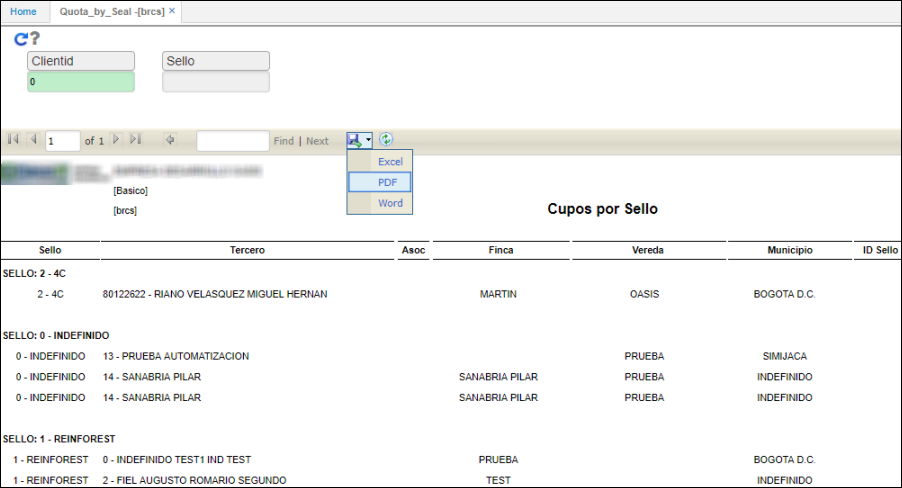

# BRCS - Cupos por Sello

El reporte **BRCS** muestra los saldos de cupos de sellos por tercero.  

Ingresamos los datos de consulta y damos click en el botón .  

**ClienteId:** digitamos el número de identificación del cliente por el cual se va a consultar o lo seleccionamos del zoom. Si se desea hacer la consulta para todos los cliente ingresamos el número 0.  
**Sello:** ingresar el número de sello correspondiente para la consulta, dejamos el campo en blanco si deseamos consultar todos los sellos.  

El reporte puede ser exportado en formato Excel, PDF o Word.  

