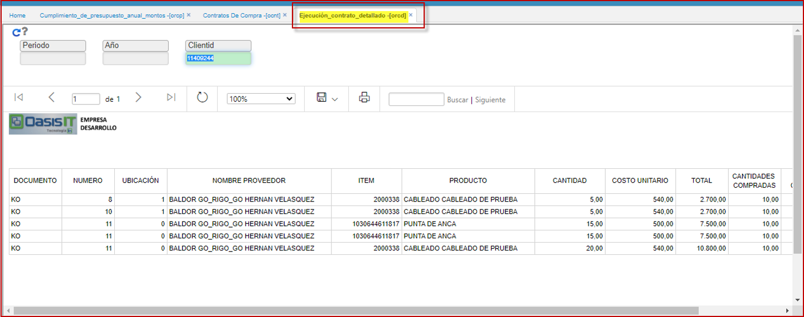

# Ejecucion Contrato Detallado - ORCD

Extrae la información por un lapso de tiempo dado, ejemplo marzo-mayo, marzo-agosto, etc, en el cual visualiza, el avance en el cumplimiento de los contratos de compra con los proveedores.

  

Suma todos los contratos del proveedor en el año de consulta (toma la fecha inicial del contrato para determinar en que año lo debe mostrar)   

