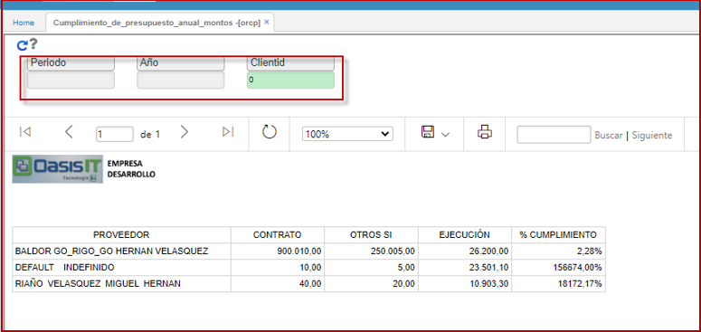

# Cumplimiento de Presupuesto Anual Montos - ORCP

Extrae la información por un lapso de tiempo (PERIODO), en el cual visualiza, el avance en el cumplimiento de los contratos de compra con los proveedores anualizado.

  

**Contrato**: Suma todos los contratos del proveedor en el año de consulta (toma la fecha inicial del contrato para determinar en que año lo debe mostrar) - Campo Assured.  
**Otros Si:** Sumar todos los otros si del proveedor en el año de consulta (tomar la fecha inicial del contrato para determinar en que año lo debe mostrar) - Campo OtherIf  
**Ejecucion:** Received * Price de todos los contratos del proveedor.  
**Cumplimiento%:**  ejecución / contrato - otro si.  

