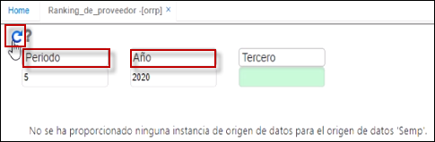

# Cumplimiento de Presupuesto Anual Montos - ORCP

**Contrato**: Suma todos los contratos del proveedor en el año de consulta (toma la fecha inicial del contrato para determinar en que año lo debe mostrar) - Campo Assured.  
**Otros Si:** Sumar todos los otros si del proveedor en el año de consulta (tomar la fecha inicial del contrato para determinar en que año lo debe mostrar) - Campo OtherIf  
**Ejecuccion:** Received * Price de todos los contratos del proveedor.  
**% cumplimiento:**  EJECUCIÓN / CONTRATO - OTRO SI.  

Reporte que permite visualizar el ranking de proveedores, es decir, muestra un listado donde aparece desde el proveedor al que más le hemos comprado hasta el proveedor al que menos le hemos comprado.  Adicionalmente, nos muestra el porcentaje de participación en el periodo y también muestra el valor acumulado desde el inicio del año hasta la fecha de la cantidad y el valor de las compras además del porcentaje de participación de ese valor acumulado durante el año.  

  

  

